# Individual Report

# Developed by Nuno Ribeiro (1230201)

This file documents the work executed in terms of individual work for the First Part of QSOFT Project.

## Contents

---

-   [List of Figures](#listOfFigures)
-   [1. Introduction](#introduction)
-   [2. Maintainability](#maintainability)
    -   [2.1. Cumulative Component Dependency](#ccd)
    -   [2.2. Propagation Cost](#pc)
    -   [2.3. Indentation Debt](#id)
    -   [2.4. GQM - What's the maintainability of production code?](#2.4)
-   [3. Performance](#performance)
    -   [3.1. Scenario 1 - "Normal conditions"](#sc_1)
    -   [3.2. Scenario 2 - "Abnormal conditions"](#sc_2)
    -   [3.3. GQM - What's the system performance?"](#3.3)
-   [4. Security](#security)
    -   [4.1. Domain class analysis](#dca)
    -   [4.2. Dependencies' vulnerability analysis](#dva)
    -   [4.3. GQM - What are the system's security problems?](#4.3)
-   [5. Architectural compliance](#architecturalCompliance)
    -   [5.1. Class and package containment](#cpc)
    -   [5.2. Inheritance](#inh)
    -   [5.3. GQM - Does the system consistently follow architectural principles?](#5.3)
-   [6. Maintainability of test code](#maintainabiltyOfTestCode)
    -   [6.1. Details of the test smells](#details_ts)
    -   [6.2. Practical analysis of the test smells' results](#conclusion_ts)
    -   [6.3. GQM - What's the maintainability of test code?](#6.3)
-   [7. Conclusions](#conclusions)
-   [References](#references)
-   [Appendices](#appendices)
    -   [Appendix I - Load Test](#appendix-i)

<div style="page-break-after: always;"></div>

<a name="listOfFigures"></a>

## List of Figures

---

-   [Figure 1 - Cumulative Component Dependency](#figure1)
-   [Figure 2 - SonarGraph - Cumulative Component Dependency](#figure2)
-   [Figure 3 - SonarGraph - Propagation Cost](#figure3)
-   [Figure 4 - SonarGraph - Number of components](#figure4)
-   [Figure 5 - Histogram graph of Indentation Debt](#figure5)
-   [Figure 6 - Formal scenario of normal conditions](#figure6)
-   [Figure 7 - Ramp up of Load Test in normal conditions](#figure7)
-   [Figure 8 - Response time over time - Load test](#figure9)
-   [Figure 9 - Total transactions per seconds - Load test](#figure9)
-   [Figure 10 - Ramp up of Soak Test in normal conditions](#figure10)
-   [Figure 11 - Response time over time - Soak test](#figure11)
-   [Figure 12 - Total transactions per seconds - Soak test](#figure12)
-   [Figure 13 - Formal scenario of overloaded conditions](#figure13)
-   [Figure 14 - Ramp up of Stress Test in overloaded conditions](#figure14)
-   [Figure 15 - Chart pie of requests summary - Soak Test](#figure15)
-   [Figure 16 - Total transactions per second - Soak test](#figure16)
-   [Figure 17 - List of vulnerabilities](#figure17)
-   [Figure 18 - Maven repository of `dom4j`](#figure18)
-   [Figure 19 - Example of architecture compliance - Classes and Packages containment](#figure19)
-   [Figure 20 - Example of architecture compliance - Inheritance](#figure20)
-   [Figure 21 - JNose - Tests by class](#figure21)
-   [Figure 22 - JNose - List of test smells found](#figure22)

<div style="page-break-after: always;"></div>

<a name="introduction"></a>

## 1. Introduction

---

This document is designed to help in the process of responding to questions defined in the Goal Question Metric (GQM), as cited in the global report. Without delving into exhaustive details of the GQM to avoid redundancy with the global report, one brief explanation is that the goal is to evaluate whether a specific software component, on this case is this the software to be analyzed in this document, meets defined quality attributes to be considered reusable. These attributes encompass performance, maintainability, test code maintainability, security, and consistent principles of architectural compliance, all contributing to a comprehensive assessment of the potential reuse of the software. This software has its scope within the finance domain and supports the management of people and groups. Inside groups exist people, and they can have familiar relationships among them. Finally, this software supports transactions inside of a ledger that records all of them. More information about the project is found on the global report.

In crafting this document, it was decided to focus on the "Person" aggregate whenever specific methods or classes were suitable for evaluation. Alternatively, in some cases, where it was necessary to choose a holistic metric, it was chosen without the scope of the Person. Once all pertinent information is obtained, the intention is to merge it with data from other aggregates, facilitating a comprehensive conclusion regarding the GQM

<div style="page-break-after: always;"></div>

<a name="maintainability"></a>

## 2. Maintainability

---

This section addresses the system's maintainability and explores how to address the GQM questions related to maintainability. It's important to note that while this document emphasizes certain global aspects, there is also a specific focus on particular classes within the system or specific metrics, given that the goal is to conclude at some level of the system taking in consideration some metrics, so after that, it can could be possible to conclude to all system merging all the collaborative work.

<a name="ccd"></a>

### 2.1. Cumulative Component Dependency (CCD)

The initial phase of this analysis involves calculate the CCD for specific classes to comprehend the interdependencies between them. CCD is the sum of the classes that each class depends upon, and with that it's possible to have some notion of the coupling of the system [1].

For this measurement, 6 classes related to the Person aggregate were chosen to check their coupling. To conduct the calculation, it was necessary to examine the dependencies of each class. In the provided code snippet, for instance, the `CreatePersonControllerREST` class depends on the `CreatePersonService` class, given that it is an attribute of the controller, contributing to count as one dependency.

```java
@RestController
public class CreatePersonControllerREST {

    @Autowired
    private CreatePersonService service;

                (...)
}
```

After identifying all the classes that one class depends on, and associating that with an arrow, for example, it's fundamental to trace the nodes that can be referenced traversing through the dependencies, counting with itself. Each class is then assigned a value based on the classes that is dependents, and then, is necessary to sum up the values assigned to each class, and then the CCD value is obtained.

In this particular scenario, as shown in Figure 1, calculating the CCD value involves summing all the individual class values, resulting in a total of 18. It's notable that the value objects' classes, such as `CategoryID` and `PersonID`, has no dependencies, which translates to a value one, because this classes are independent. However, in contrast, the CreatePersonControllerREST stands out as the primary entry point for the REST API. Consequently, has the higher CCD value.

<a name="figure1"></a>

|     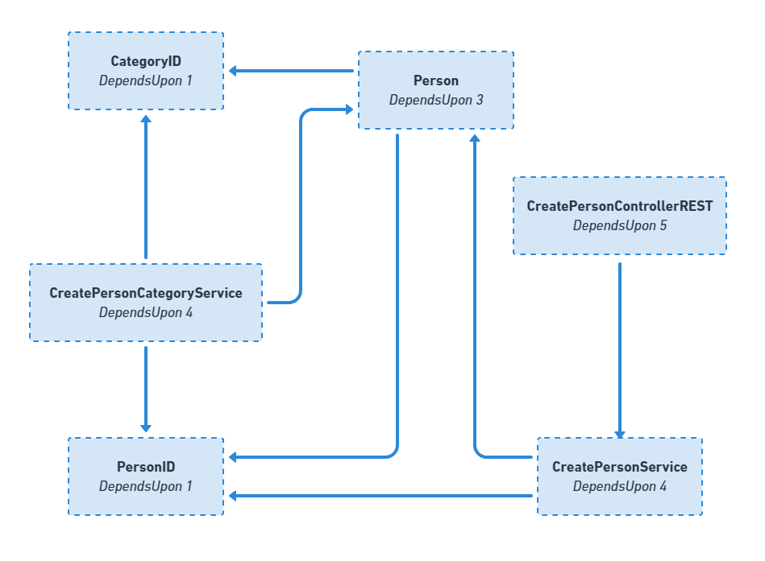      |
| :------------------------------------------: |
| _Figure 1 - Cumulative Component Dependency_ |

Using a tool like SonarGraph it's possible to verify the value of global CCD, which is represented in Figure 2.

<a name="figure2"></a>

|           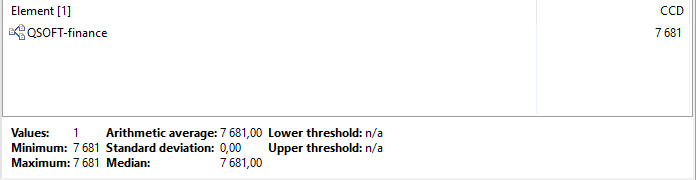           |
| :-------------------------------------------------------: |
| _Figure 2 - SonarGraph - Cumulative Component Dependency_ |

<a name="pc"></a>

### 2.2. Propagation Cost (PC)

The PC metric is responsible for giving an "idea how tightly coupled a system is" and how possible is that changes in one part of the system are likely to affect many other parts [1].

The value of this metric can be obtained by relating the CCD to the total number of components. To do this, the number of CCDs must be divided by the squared number of components. In order to speed up the process, the PC value it will be obtained by using the tool SonarGraph.

As it's possible to verify, observing the Figure 3, the system's PC is 6.05. However, only with this value is it hard to conclude something, so it's necessary to compare with the total number of components.

<a name="figure3"></a>

|    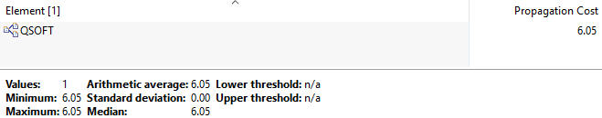    |
| :----------------------------------------: |
| _Figure 3 - SonarGraph - Propagation Cost_ |

The thresholds outlined in reference [1] says the follows:

-   For small systems (with n < 500), higher PC values are less concerning.
-   For mid-sized systems (500 ≤ n < 5000), PC values over 20% are concerning, and values over 50% suggest serious issues with large cycle groups.
-   For large systems ( n ≥ 5000 n ≥ 5000), even a value of 10% is concerning.

Now, it's fundamental to obtain the total number of components, for that it was used, once again, the SonarGraph, and the value is 357, as shown in the Figure 4.

<a name="figure4"></a>

| 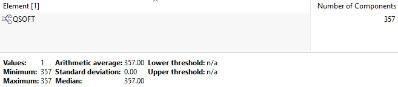 |
| :----------------------------------------------: |
|  _Figure 4 - SonarGraph - Number of components_  |

With the number of PC at 6% and the number of components at 357, taking in consideration the thresholds before, is possible to conclude that the system has good results in terms of coupling.

<a name="id"></a>

### 2.3. Indentation Debt

Indentation debt is a metric that plays an important role on evaluating the complexity of the code by focusing on the analysis of indentation patterns. The indentation count serves as a parameter for assessing the complexity of classes or methods. A higher indentation level often suggests a more complex structure, so it takes to consider the decomposition of method into more granular units [1].

According to Christian Ciceri, Et al. [1], there is a consensus that the maximum acceptable indentation level is set at 4. This guideline implies that code sections should ideally not exceed a four-level indentation, something that goes beyond that could lead to future problems of maintainability.

To support this rationale, a code snippet is provided to illustrate the counting of indentations. Where is possible to verify that for each conditional logic, the indentation level increases by one. In the given example, there are three `if's` statements, each contributing to an indentation debt of three.

<div style="page-break-after: always;"></div>

```java
    public void createPerson(CreatePersonDTO createPersonDTO) {
        if (createPersonDTO.getEmail() != null) { // Indentation debt of 1
            if (createPersonDTO.getEmail().equals("example")) { // Indentation debt of 2
                if (createPersonDTO.getEmail().contains("example")) { // Indentation debt of 3
                }
            }
        }
    }
```

Following the introduction, it’s now examined the project with the objective of verifying its maintainability taking in consideration the indentation debt. The project's value is measured using the tool SonarGraph, and the metric being obtained is called `Max Block Nesting Depth` on the tool. The results, which can be presented in a histogram graph, like shown in Figure 5 , reveal that among 357 components, only one exceeds an indentation depth of 4. This observation is highly positive, aligning with the Christian Ciceri, Et al. recommendations and, for that reason, the metric's values is entirely acceptable.

<a name="figure5"></a>

|  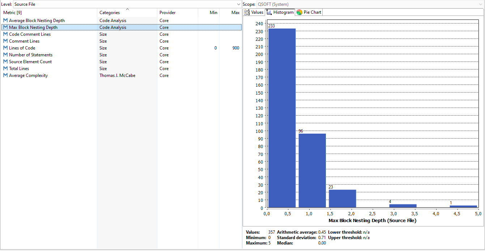   |
| :----------------------------------------------: |
| _Figure 5 - Histogram graph of Indentation Debt_ |

<a name="2.4"></a>

### 2.4. GQM - What's the maintainability of production code?

Considering that Propagation Cost and Indentation Debt contain values within the predefined acceptable thresholds, it is possible to conclude that the application, in the scope of this document, <span style="color:green">**has acceptable maintainability of the production code.**
</span>

<div style="page-break-after: always;"></div>

<a name="performance"></a>

## 3. Performance

---

The upcoming sections of this document will delve on three scenarios chosen to respond to the question of the GQM Plan related to the performance. This document exclusively concentrates on the aggregate Person and will focus on critical aspects of this aggregate, the testing will specifically target the fundamental endpoint concerning of creations of persons' records. The endpoint to be tests is the follow:

-   Register a new person’s record in the system. (HTTP REST - POST /persons)

> This endpoint is located on the `CreatePersonControllerREST class`.

**Tool to be used**

The JMeter tool will be employed for conducting these tests, with the rationale and supported use cases elaborated in detail within the global report

<a name="sc_1"></a>

### 3.1. Scenario 1 - "Normal conditions"

**Raw scenario**

The system must process and respond to requests for creating new person’s records, under the normal load of 400 users, with a response time of 3 seconds.

**Formal scenario**

The formal scenario takes place in Figure 6.

<a name="figure6"></a>

|         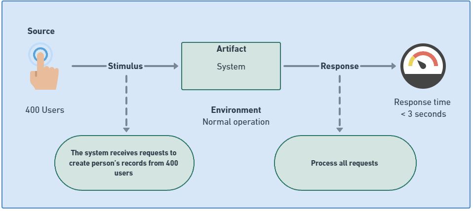         |
| :-----------------------------------------------: |
| _Figure 6 - Formal scenario of normal conditions_ |

#### **Load test**

As the scenario centers around typical user loads, the `Load test` will be responsible to verify if the system can handle a normal interaction of virtual users with the system in a considered short period of time.

<div style="page-break-after: always;"></div>

_Ramp-up_

The pattern chosen is represented on Figure 7, and is called **Steady ramp-up pattern** where the objective with this ramp-up pattern is to simulate the flow of a normal day-a-day work, where it smoothly increases the number of virtual users interaction against the system at the beginning, but after at certain point it keeps a steady format.

<a name="figure7"></a>

|            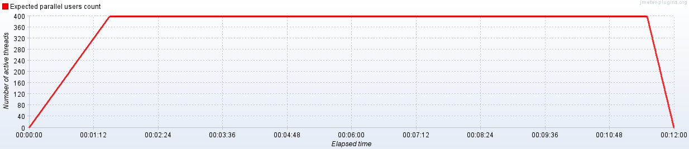            |
| :----------------------------------------------------: |
| _Figure 7 - Ramp up of Load Test in normal conditions_ |

_Data mock configuration - CSV_

To acquire the requisite data for simulating the insertion of records, a Python script was developed to generate mock data for individuals in format `csv`, ensuring uniqueness of all email addresses. The script, along with detailed information about JMeter, is available in the [Appendix I section](#appendix-i).

_Results_

After the execution of the test it's possible to get the information needed to conclude about this test scenario.

As the chosen metric was "Response Time" it was added the listener capable to describe the response time over time `jp@gc - Response Times Over Time` and was extracted the respective graph.

Analyzing the Figure 8 it's possible to notice that the response time starts well, so it’s possible to conclude that with a low number of interactions the server can handle all the cases with good response time, but as soon the number of interactions start to raise, its noticeable that the response time starts to go up and an certain time it passes the 3 seconds for a considerable amount of times.

<a name="figure8"></a>

|  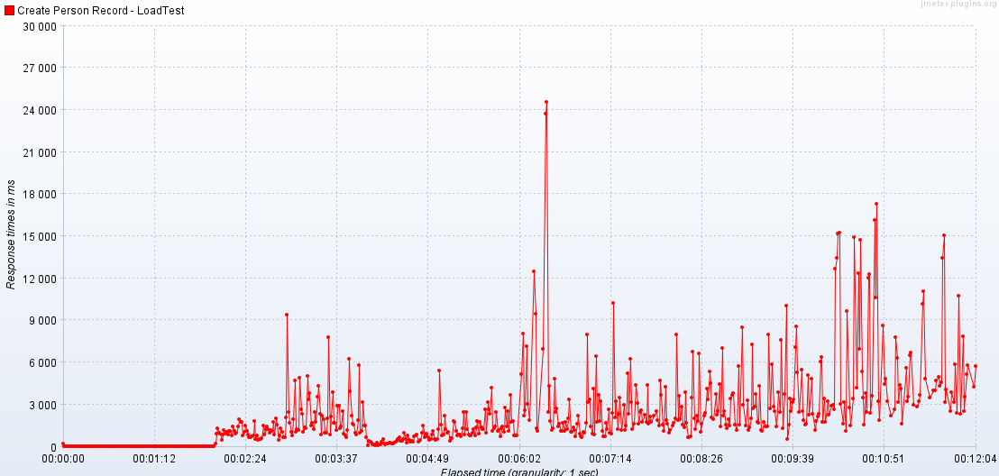  |
| :----------------------------------------------: |
| _Figure 8 - Response time over time - Load test_ |

Examining Figure 9 reveals a notable increase in the number of failed transactions, with errors manifesting almost immediately after the test initiation. Analyzing the results of dashboard data it's possible to verify that these errors are `Connection failed`. Consequently, it can be deduced that the system, under this level of load, struggles to process requests accurately

<a name="figure9"></a>

|      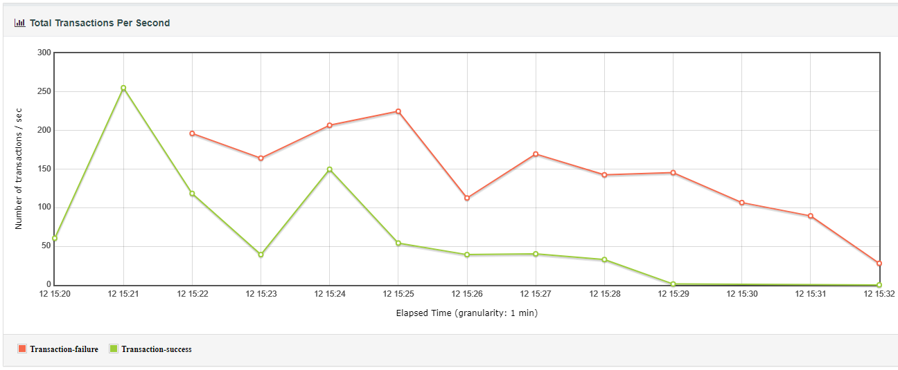      |
| :-----------------------------------------------------: |
| _Figure 9 - Total transactions per seconds - Load test_ |

#### **Soak test**

In the same scenario, given that the scope of the scenario is the normal operation, it's essential to test the endurance of the system over the time, executing the same normal operation, in order to guarantee that the system is able or not to operate correctly on the essential requirements about the creations of persons' record.

Given that the Load Test failed, the motivation of this test, is to check the severity problems of performance.

<div style="page-break-after: always;"></div>

_Ramp-up_

The selected pattern aligns with the Load Test concept, but with the distinction that this test will execute approximately 500% longer, spanning an hour. Its objective is to verify the system's performance over extended durations, mimicking real-world, day-to-day operations, and for that reason, it wil be used a **Steady ramp-up pattern**, as shown in Figure 10.

<a name="figure10"></a>

|           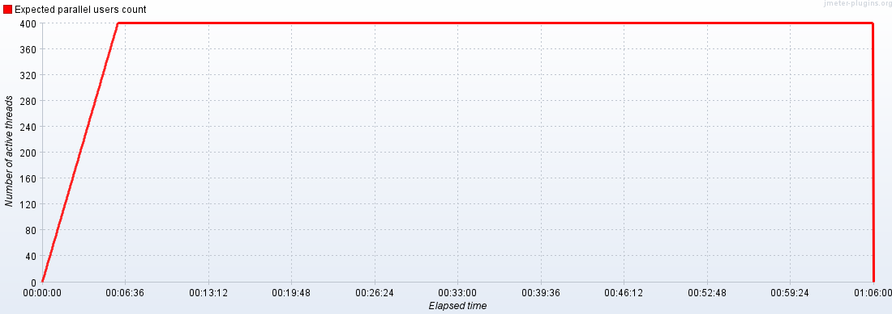           |
| :-----------------------------------------------------: |
| _Figure 10 - Ramp up of Soak Test in normal conditions_ |

_Data mock configuration - JMeter default functions_

In this test it was used a strategy different from the Load Test cited before for the request's payload. On this time, it was used the function of JMeter that generates random numbers with the objective to append it to an fixed email, to guarantee that the email is always new in the system (with the notion that exists a possibility to have the same random number). The request body stays like the follows:

```json
{
    "email": "email${__Random(0000,9999999)}@email.com",
    "name": "Fixed named",
    "birthdate": "2000-01-01",
    "birthplace": "Fixed Birthplace Local"
}
```

_Results_

In the same logic as the load test, it is necessary to place a listener capable of recording the response time throughout the test.

It's easy to analyze, observing the Figure 11, that the system is not able to have a consistent response time of 3 seconds. This conclusion was predictable because of the past result of the Load Test, but with this new graph it's possible to verify that the system tends to get worse as the time passes.

<a name="figure11"></a>

|  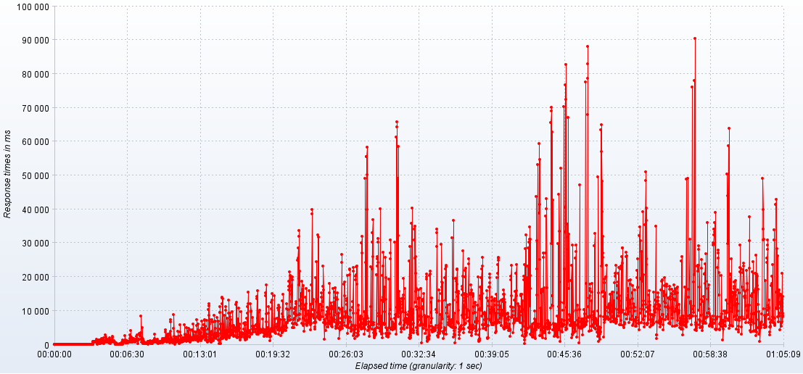   |
| :-----------------------------------------------: |
| _Figure 11 - Response time over time - Soak test_ |

Analyzing the Figure 12, as anticipated, the system reaches a point where it either struggles or is unable to respond successfully, resulting in errors. This recurrence aligns with the pattern observed in the Load Test, accentuating an increase of the severity over time on this endurance test.

<a name="figure12"></a>

|      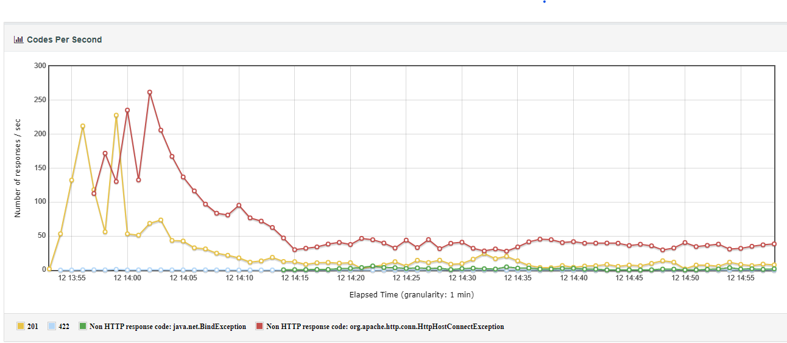       |
| :------------------------------------------------------: |
| _Figure 12 - Total transactions per seconds - Soak test_ |

_Conclusion_

After analyzing the result's graphs of Load and Soak tests, it can be concluded that the application, on this endpoint, is not able to meet the required standards over a short and long period of time in a normal operation.

<div style="page-break-after: always;"></div>

<a name="sc_2"></a>

### 3.2. Scenario 2 - "Abnormal conditions"

**Raw scenario**

The system must process and respond to requests for creating new person’s records, under a overloaded load of 200% above the considered normal (making 400 users), with a percentage of success in the responses over 80%.

**Formal scenario**

The formal scenario takes place in Figure 13.

<a name="figure13"></a>

|           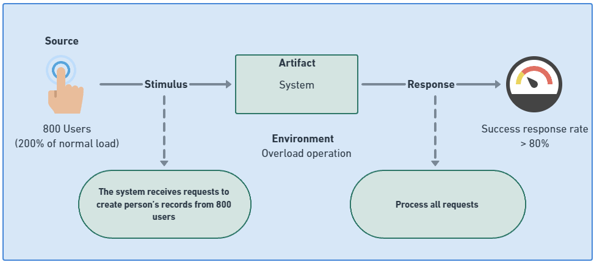            |
| :----------------------------------------------------: |
| _Figure 13 - Formal scenario of overloaded conditions_ |

As this scenario represents an unusual case, the objective becomes to deliver a number of success rates at 80% and not the time each response takes

**Ramp-up**

The selected pattern for this test was the **Steady ramp-up pattern**, wherein the total time was divided into two segments. The initial half of the duration was allocated for the system to gradually reach the desired number of users, while the remaining time maintained a consistent user load. This approach is inspired on the Load Test, but now simulating an unusual surge in user interactions. Although such scenarios might be uncommon, the overall flow remains consistent: there might be fewer clients attempting to create records in the financial application at the beginning of the day, but after that it's stays on a constant demand.

<a name="figure14"></a>

|             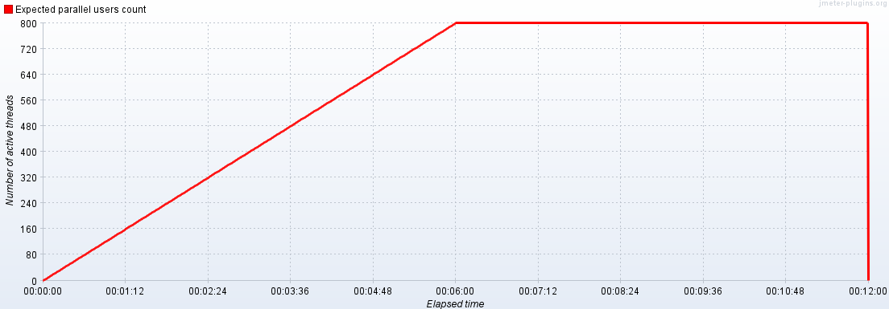             |
| :-----------------------------------------------------------: |
| _Figure 14 - Ramp up of Stress Test in overloaded conditions_ |

#### **Stress test**

The focus of this scenario is to aim on the limits of the system, for that it will be done a stress test.

_Data mock configuration - JMeter default functions_

In this test it was used the same strategy used on the Soak Test, so it was used the random number function of JMeter to generate uniques emails.

_Results_

To have a notion of the system's response success rate, an examination of the percentages in the generated dashboard was needed, as Figure 15 shows. To better understand, Figure 16 illustrate the total count of successful transitions compared to failed ones. A brief analysis quickly reveals that the system did not meet expectations, with a mere ~28% success rate. Notably, within the initial two minutes, the number of failed responses surpassed the count of successful responses, indicating a severe performance issue

<a name="figure15"></a>

|           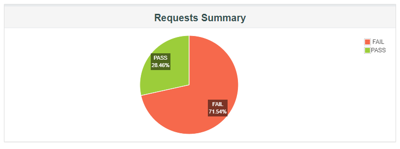           |
| :-----------------------------------------------------: |
| _Figure 15 - Chart pie of requests summary - Soak Test_ |

<a name="figure16"></a>

|     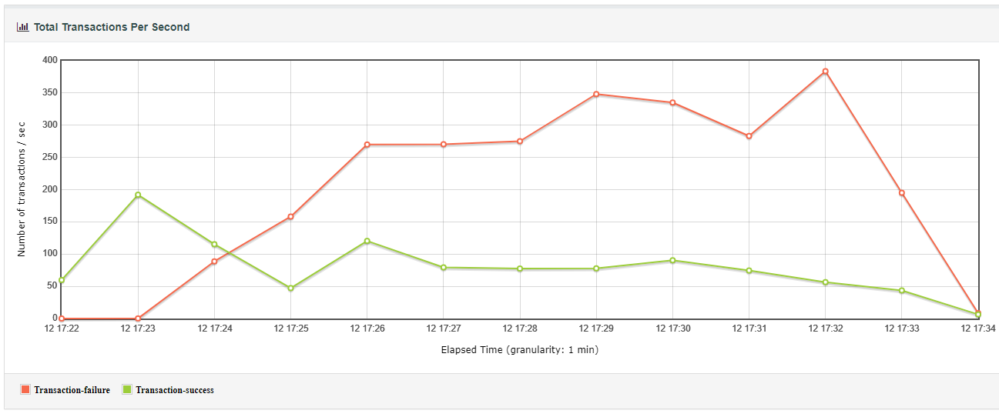     |
| :-----------------------------------------------------: |
| _Figure 16 - Total transactions per second - Soak test_ |

_Conclusion_

With the results is easy to conclude that the stress test was not successfully because the metric it was bellow of the number excepted.

<a name="3.3"></a>

### 3.3. GQM - What's the system performance?

After testing and analyzing all scenarios, it became clear that the system failed to meet the specified metrics in every instances. The results consistently were below the required thresholds, indicating that the system lacks the necessary conditions for successful reuse.

It's important to emphasize that this conclusion belongs specifically to the Person aggregate, but from the results, it's possible to say that the system <span style="color:red">**has not a acceptable performance.**</span>

<div style="page-break-after: always;"></div>

<a name="security"></a>

## 4. Security

---

This section will help answer the GQM question regarding security issues, being necessary to analyze vulnerabilities at the level of dependencies, as well as analyzing validations at the domain layer, taking into account that this document is focused on the Person aggregate.

<a name="dca"></a>

### 4.1. Domain class analysis

It is of great importance that the software in question has class-level validations, both at the level of constructor methods and at the level of setter methods, to ensure that there are no instances that could become malformed and could be turned into dangerous records in the database. So, to verify this specific issue, was created a measurement to classify the classes and thus conclude whether the classes to be analyzed can be considered safe or not, as described in the table below.

| Measurement | Rational                                                              |
| ----------- | --------------------------------------------------------------------- |
| 1           | No validations                                                        |
| 2           | Has validations only in terms of technical perspective\*              |
| 3           | Has validations only in terms of technical and domain perspective\*\* |

> _\*Technical perspective_ : The software checks for validations in terms of Java compilation errors, e.g., check if the instance is not null, the list doesn't contain null values, etc., but ignores the domain validation, for example, an email's String has the same treatment as an address's String in this level.
>
> _\*\*Domain perspective_ : In addition to technical validations, the software checks for validations in terms of the domain, for example, if the email is on the expected format.

Considering the threshold for acceptability in terms of validation, having all classes on the third level is the necessary to be considerably acceptable

For the analysis, it will be taken classes from the Person aggregate, and the classes are the following:

-   `Email Classs`
-   `Birthdate Class`
-   `Person Class`
-   `Name Class`
-   `Person Class`

#### Email Class

The `Email class` is responsible for representing an instance of a person's email in the system, so it is expected that the system will be able to validate whether the email is valid under the email rules or not.

However, as shown in the code below, it's possible to verify that the constructor method only checks for technical aspects, as if the email is null or empty, but it would be expected to also check if the email is valid in terms of domain, for example, with the usage of a regex condition.

<div style="page-break-after: always;"></div>

```java
    private Email(String email) {
        if (email == null || email.equals("")) {
            throw new IllegalArgumentException("Email not created due to the fact that the email parameter hasn't a valid argument");
        }
        this.email = email;
    }
```

**The metric level to `Email class` is 2.**

#### Address Class

Following the same logic, when seeking an address is expected that the address is associated with a real-world address, which can be done by using an external API or a database of addresses, for example, or simply to check if the length is considerable long.

Analyzing the code below is possible to see that the system is only making technical aspects validations, such as ensuring that the input parameters are not null, but not checking if, e.g., the street value has a valid number of characters or checking that value on a external API if the street really exists.

```java
    private Address(String street, String doorNumber, String postCode, String city, String country) {
        if (street != null && doorNumber != null && postCode != null && city != null && country != null) {
            this.street = street;
            this.doorNumber = doorNumber;
            this.postCode = postCode;
            this.city = city;
            this.country = country;
        } else if (street == null) {
            throw new IllegalArgumentException("Address not created due to the invalid street parameter given");
        } else if (doorNumber == null) {
            throw new IllegalArgumentException("Address not created due to the invalid doorNumber parameter given");
        } else if (postCode == null) {
            throw new IllegalArgumentException("Address not created due to the invalid postCode parameter given");
        } else if (city == null) {
            throw new IllegalArgumentException("Address not created due to the invalid city parameter given");
        } else {
            throw new IllegalArgumentException("Address not created due to the invalid country parameter given");
        }
    }
```

<div style="page-break-after: always;"></div>

**The metric level given to `Address class` is 2.**

To not repeat the same process to all classes, which can be tedious, will be presented a table that lists all the classes marked initially to be analyzed, where the rational applied to each one is the same as seen on the two classes above.

| Class     | Metric value |
| --------- | ------------ |
| Person    | 2            |
| Birthdate | 2            |
| Address   | 2            |
| Name      | 2            |
| Birthdate | 2            |

<a name="dva"></a>

### 4.2. Dependencies' vulnerability analysis

In terms of security, a very important factor when choosing software to be reused is its relationship with vulnerabilities, so the aim is always to work with secure systems or as secure as possible. For this reason, the vulnerabilities of the systems will be analyzed below, using the [Dependency-Check tool](https://owasp.org/www-project-dependency-check/) managed by [OWASP](https://owasp.org/), in order to conclude if the system is able to be reusable or not.

After running the dependency tool over the project is possible to have a list of some vulnerabilities, as shown in Figure 17, where some of them are classified as _Critical_ which are considered dangerous and needs special attention. Considering that all this information is based on the [National Vulnerability Database.](https://www.nist.gov/)

<a name="figure17"></a>

| 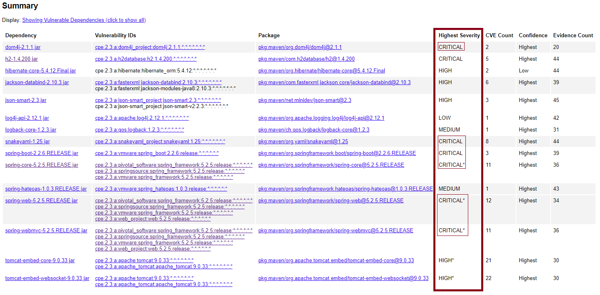 |
| :---------------------------------------: |
|   _Figure 17 - List of vulnerabilities_   |

At a high level, this software appears not very suitable for reuse, as a notable number of vulnerabilities have been identified. However, a definitive conclusion is premature, and further examination of dependencies is necessary before making a firm decision. To illustrate this process, it will be focused on one critical dependency for analysis, namely the `dom4j-2.1.1.jar` dependency

**Analyze of the dependency**

The dependency `dom4j-2.1.1.jar` has two vulnerabilities attached on the National Vulnerability Database, as it's possible to see on this [link]("https://nvd.nist.gov/vuln/search/results?form_type=Advanced&results_type=overview&search_type=all&cpe_vendor=cpe%3A%2F%3Adom4j_project&cpe_product=cpe%3A%2F%3Adom4j_project%3Adom4j&cpe_version=cpe%3A%2F%3Adom4j_project%3Adom4j%3A2.1.1"), also on the table below:

<table style="margin-left: auto;
            margin-right: auto;
            width: 100%">
    <tr>
        <th>Vulnerability ID</th>
        <th>Summary</th>
        <th>CVSS Severity</th>
    </tr>
    <tr>
        <td>CVE-2023-45960</td>
        <td> An issue in dom4.j org.dom4.io.SAXReader v.2.1.4 and before allows a remote attacker to obtain sensitive information via the setFeature function. NOTE: the vendor and original reporter indicate that this is not a vulnerability because setFeature only sets features, which "can be safe in one case and unsafe in another."  *Published: October 25, 2023; 2:17:35 PM -0400*</td>
        <td>V3.1: 7.5 HIGH | V2.0:(not available)</td>
    </tr>
      <tr>
        <td>CVE-2020-10683</td>
        <td> dom4j before 2.0.3 and 2.1.x before 2.1.3 allows external DTDs and External Entities by default, which might enable XXE attacks. However, there is popular external documentation from OWASP showing how to enable the safe, non-default behavior in any application that uses dom4j. *Published: May 01, 2020; 3:15:12 PM -0400*</td>
        <td>V3.1: 9.8 CRITICAL | V2.0: 7.5 HIGH</td>
    </tr>
</table>

As evident from the observation, both vulnerabilities impact the current version in use. The first vulnerability, as reassured by the vendor, is not directly dangerous. The second vulnerability, OWASP recommends specific procedures to secure the application when utilizing this dependency in the current version. However, the decision to retain this dependency may have associated risks. Hence, exploring alternative, more up-to-date versions could be a prudent solution.

As illustrated in Figure 18, examining the Maven repository related to `dom4j` reveals that there are no versions without associated vulnerabilities. Consequently, this dependency is considered problematic and have a potential risk given there is no other versions to upgrade.

<a name="figure18"></a>

|    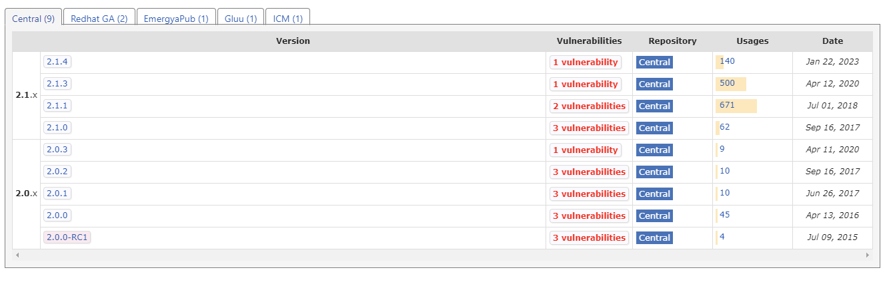     |
| :---------------------------------------: |
| _Figure 18 - Maven repository of `dom4j`_ |

<div style="page-break-after: always;"></div>

<a name="4.3"></a>

### 4.3. GQM - What are the system's security problems?

In conclusion, as far as security is concerned, it can be concluded that the system does not meet the expectations, since in terms of validations it only achieves a value of 2 in the measurement that classifies the quality of security validations, and the objective was the level 3. Furthermore, in terms of vulnerabilities, there are some considerable critical dependencies, and the specific vulnerability analyzed in this document lacks a recent version that is free from risks. Consequently, based on the findings in this document, the response to the GQM question concerning security is that the software <span style="color:red">**has not acceptable security.**</span>

<div style="page-break-after: always;"></div>

<a name="architecturalCompliance"></a>

## 5. Architectural compliance

---

In this step, it's ensure that the software complies with consistent architectural rules, to verify that the software is suitable for reuse in the main project, with that, this step is contributing to respond to the question of the GQM Plan related to the architecture compliance scope. For this reason, it will be checked for good conventions in the location of classes related to the package and whether this software uses good conventions when performing inheritance.

For these tests, the tool ArchUnit will be employed, and the methodology for the fitness function is inspired by [2]. This methodology essentially outlines five aspects that define the fitness function, as will be illustrated in the following cases

<a name="cpc"></a>

### 5.1. Class and package containment

In this case it's being searched for good conventions related to the Classes and the packages name that it belongs, for example, it's consider a good practice to have a Class named as Service inside of an package that is called _“[…].services”_.

#### Fitness function

-   **Breadth of feedback** : Holistic (in sense that will target aspects from all the system).
-   **Execution trigger and location** : Periodical and in the test environment.
-   **Metric type** : Direct and Nominal (True/False)
    -   _True_: The system complies with the conventions about class and packages containment, and for that **all tests needs to pass**.
    -   _False_: The system doesn't complies with the conventions about class and packages containment, and for that **at least one test needs to fail**.
-   **Automated** : No (the function needs to be manually executed).
-   **Quality attribute requirement** : Maintainability
-   **Function type** : Static (this fitness function is associated with metrics that are statically defined and is not necessary to have values from others fonts).

**Point to be evaluated**

For this specific fitness function it will be checked, in concrete, that:

-   Classes that contain the word _Service_ must be inside of packages that have _Services_ on the name.
-   Classes that contain the word _Controller_ must be inside of packages that have _Controllers_ on the name.
-   Classes that contain the word _Repository_ must be inside of packages that have _Repositories_ on the name.
-   Classes that contain the word _Exception_ must be inside of packages that have _Exceptions_ on the name.

To enhance comprehension of the underlying logic of the test, Figure 19 illustrates how the test operates. In essence, if there is a class that ends with 'Exception,' that class must be located within a package named 'exceptions', otherwise, the test will result in failure

<a name="figure19"></a>

|                  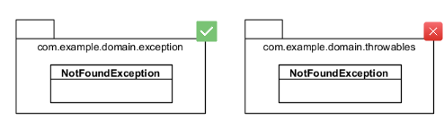                   |
| :---------------------------------------------------------------------------------: |
| _Figure 19 - Example of architecture compliance - Classes and Packages containment_ |

**Code of the test**

For the purpose of example, it's shown the test that aims into the Services, where it's specified that all classes that reside inside of an packages that ends with "Services" must have the name ending with "Service".

```java
      @ArchTest
    static void checkServicesClassAndPackageContainment(JavaClasses classes) {
        classes().that().resideInAPackage("..*Services")
                .should().haveSimpleNameEndingWith("Service")
                .check(classes);
    }
```

Having distinct methods for each one of the cases is a good practice to ensure good maintainability in the test code, to avoid eager tests. This approach involves creating methods with a singular focus, keeping them concise and objective. Conversely, if a single large method were created, it would be more challenging to pinpoint where the system fails architecturally.

**Results**

-   Services : <span style="color:green">Passed</span>
-   Repositories : <span style="color:red">Failed</span>
-   Exceptions : <span style="color:green">Passed</span>

With the results of the test, it’s possible to conclude that the system complies with good conventions on the responsibility of Services and Exceptions, but fails on the Repositories, because the package has "Repositories" on the name, but the class ends with REST, which is considered a not good convention. However, the change of the Controller could be done easily, so, after all the Architecture Compliance tests be done, and if it's considered that all system is great, and only the Repositories conventions are missing, it could be an option to change the repositories names.

> Note: This conclusion is focused only on this metric, the global conclusion it's on the global report.

<a name="inh"></a>

### 5.2. Inheritance

In this case, the objective is to ensure the consistent application of good naming conventions within the scope of inheritance, including the implementation of interfaces. It is considered a good practice if the child class has the name of the parent class or if the concrete class has the name of the interface being implemented.

<div style="page-break-after: always;"></div>

#### Fitness function

-   **Breadth of feedback** : Holistic (in sense that will target all the system).
-   **Execution trigger and location** : Periodical and in the test environment.
-   **Metric type** : Direct and Nominal (True/False)
    -   _True_: The system complies with the conventions about inheritance, and for that **all tests needs to pass**.
    -   _False_: The system doesn't complies with the conventions about inheritance, and for that **at least one test needs to fail**.
-   **Automated** : No (the function needs to be manually executed).
-   **Quality attribute requirement** : Maintainability
-   **Function type** : Static (this fitness function are associated with metrics that are statically defined and is not necessary to have values from others fonts).

**Point to be evaluated**

For this specific fitness function it's being checked, in concrete, that:

-   Classes that implements the interface _Entity_ must contain the word "Entity" to make it easy to identify what type of domain class it is.
-   Classes that implements the interface _ValueObject_ must contain the word "ValueObject" to make it easy to identify what type of domain class it is.
-   All the implementations of the persistence's interfaces must have the name that associates it to the interface, for example, the interface `ISomethingRepository` must be implement by the `SomethingRepository` concrete class.

In order to facilitate the understanding of the logic that is beyond the test, the Figure 20 shows how the test will work, so, if the system has a concrete class that implements the interface Entity, it's necessary that class's names ends with Entity.

<a name="figure20"></a>

|        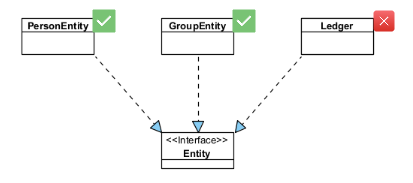        |
| :------------------------------------------------------------: |
| _Figure 20 - Example of architecture compliance - Inheritance_ |

**Code of the test**

For the purpose of example, it's shown the test that aims into the Entities interfaces, where it's specified that all classes that implements that interface must have the name ending on "Entity".

<div style="page-break-after: always;"></div>

```java
  @ArchTest
    static void checkInheritanceOfEntitiesInterface(JavaClasses classes) {
        classes().that().implement(Entity.class)
                .should().haveSimpleNameEndingWith("Entity")
                .check(classes);
    }

```

**Results**

-   Category Persistence : <span style="color:green">Passed</span>
-   Entities Interfaces : <span style="color:red">Failed</span>
-   Person Persistence : <span style="color:green">Passed</span>
-   Value Objects Interfaces : <span style="color:red">Failed</span>

With the results of the test, it’s possible to conclude that the system complies with good conventions about the name on inheritance, but only in terms of persistence concrete class names, given that all of them have the ending name being the same as the interface name. However, this fitness function fails on the Entities and ValueObjects names, because on the domain classes none of them have some description of what could be, so it's confusing in terms of distinguish from and Entity to a ValueObject in the code. For instance, observing a class named solely `Address` makes it difficult to determine at first glance whether it is an entity or a value object.

<a name="5.3"></a>

### 5.3. GQM - Does the system consistently follow architectural principles?

Given the failure of both fitness functions, it's not suitable to change the architecture taking in consideration that both failed, and for that, it is prudent to state that the application <span style="color:red">**has not a acceptable and consistent adherence to architectural principles.**</span>

<div style="page-break-after: always;"></div>

<a name="maintainabiltyOfTestCode"></a>

## 6. Maintainability of test code

---

This section centers on evaluating the maintainability of tests, a important consideration when contemplating the reuse of software, which is the case studied in the context of the GQM defined. So, the objective here is to respond to the GQM question, specifically focusing on how the software performs in response to this analysis. Importantly, this examination is delimited to the classes within the Person aggregate, which will contribute to the overall consideration when all collaborative work has merged.

The existing tests' code smells will be analyzed using the JNose tool, with a specific focus on the most important class of the aggregate. After obtaining the test report given by the tool, it is crucial to search for false positives and draw conclusions regarding the identified code smells. To identify test smells within a class, it's necessary to designate the appropriate `Test Class` responsible for housing the methods to be tested. Additionally, selecting the corresponding `Production Class` is essential in to order to let JNose detect Eager Tests and Lazy Tests, as illustrated in Figure 21.

<a name="figure21"></a>

|  |
| :--------------------------------------: |
|   _Figure 21 - JNose - Tests by class_   |

This approach gives the possibility to examine the tests smells that were detected on the class selected. As shown in Figure 22, it's possible to easily see the list of potential test smells.

<a name="figure22"></a>

|   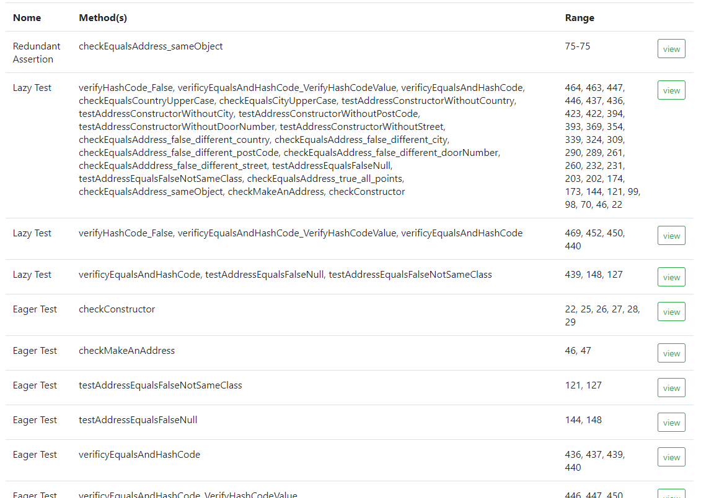    |
| :---------------------------------------------: |
| _Figure 22 - JNose - List of test smells found_ |

The list appears extensive, and for that reason the total it will now be resumed in the following table:

**`AddressTest`** has the following test smells:

-   Redundant Assertion: 1
-   Lazy Test: 35
-   Eager Test: 7
-   Assertion Roulette: 26

> Total of 69 test smells

In the same sequence it will be scan now the **`PersonTest`**:

-   Redundant Assertion: 26
-   Verbose Test: 24
-   Lazy Test: 35
-   Eager Test: 59
-   Assertion Roulette: 94

> Total of 238 test smells

Prior to reaching conclusions based on the results obtained earlier, it is important to offer a brief explanation of the test smells most popular. Taking in count that are a lot more additional test smells to consider, but for this particular case, it will be described as follows.

<a name="details_ts"></a>

### 6.1. Details of the test smells

In this part it will be describe each description based on the reference .

**Redundant Assertions**

The tests that are classified to having a redundant assertion are tests that have inside some assertions that always give the same static result, for example, assertions that verifies if the string "test" is equals to the string "test" [3].

**Verbose tests**

This tests has a lot of content turning them difficult to read and understand, and maintain. Are tests that have more content that are needed [4].

**Lazy Tests**

Lazy tests can manifest when a class contains numerous methods repeatedly testing the same functionality, even if each method utilizes different instances [4].

**Eager Tests**

These tests are characterized by the inclusion of numerous unrelated functionalities within the same method. This practice raises concerns for maintainability as the method lacks a clear focus on a single, well-defined purpose [5].

**Assertion Roulettes**

These type of tests are dangerous because they lack a clear conclusion or description for the assertions. Consequently, when a test fails, it becomes challenging to understand the specific reasons behind the failure [3].

**Ignored Tests**

An ignored test is one marked for exclusion, often denoted by the @Ignore annotation in JUnit. At first sight it might inoffensive, but it has implications because consumes compilation time and adds complexity and comprehension to the code [3].

**Flaky Test**

"Flaky tests are software tests that exhibit a seemingly random
outcome (pass or fail) despite exercising unchanged code. In this
work, we examine the perceptions of software developers about
the nature, relevance, and challenges of flaky tests", Moritz Eck, Et. Al, [6].

<a name="conclusion_ts"></a>

### 6.2. Practical analysis of the test smells' results

In summary, both classes have a considerable number of tests smells, taking in consideration that the `Address class test` has 22 methods in 541 Lines of Code (LOC) and the class `Person class test` has 60 methods and 1842 LOC, making a considerable high ratio for both. (The method and LOC count was obtained from SonarGraph).

<div style="page-break-after: always;"></div>

_Assertions Roulette_

It is evident that are very few methods that provides descriptions for any of their assertions. This observation is described in the code snippet below, where the absence of descriptions in the assertions introduces ambiguity, making it challenging to understand the cause, given that exists three distinct hard assertions, for this practical example, but it's very common on all methods, which is why there are 126 smells of this type in just two classes.

> Note: this code snippet example is in the `Address Test Class` but the rational is applicable to the `Person Test Class` too.

```java
    @Test
    @DisplayName("Verify if one AccountID can be added to Accounts List || Sad case: AccountID already exist")
    public void accountIDNotAddedToAccountsList() {
        // Arrange
        PersonID personMariaID = PersonID.createPersonID("maria@gmail.com");
        LedgerID ledgerID = LedgerID.createLedgerID();
        GroupID groupID = GroupID.createGroupID("Friends");
        AccountID accountID = AccountID.createAccountID("Supermarket", groupID);
        // Act
        Group groupFriends = Group.createGroupAsPersonInCharge("Friends", personMariaID, "Old friends from school", LocalDate.of(2019, 12, 18), ledgerID);
        boolean result1 = groupFriends.addAccount(accountID);
        boolean result2 = groupFriends.addAccount(accountID);
        // Expected
        List<AccountID> accounts = new ArrayList<>();
        accounts.add(accountID);
        // Assert
        assertEquals(true, result1);
        assertEquals(false, result2);
        assertEquals(groupFriends.getAccounts(), accounts);
    }
```

_Eager Test_

It's also possible to come across methods encompassing multiple functionalities. However, in the example below, it's possible to label it as a false positive since the method appears to concentrate solely on the constructor. However, instances of positive cases do exist, where a method effectively integrates cross-functionalities within a single implementation.

```java
   @Test
    public void checkConstructor() {
        //Arrange
        String street = "rua da saudade";
        String doorNumber = "12";
        String postCode = "4000-121";
        String city = "Porto";
        String country = "Portugal";
        //Act
        Address address = Address.createAddress(street, doorNumber, postCode, city, country);
        //Assert
        assertEquals(street, address.getStreet());
        assertEquals(doorNumber, address.getDoorNumber());
        assertEquals(postCode, address.getPostCode());
        assertEquals(city, address.getCity());
        assertEquals(country, address.getCountry());
    }
```

_Verbose Test_

The example below had to be truncated to save space due to the method's excessive length. This process is unacceptable because is a severe problem in the maintainability of test classes, and, unfortunately, it is a common occurrence, particularly in the `Person Test Class`.

```java
    public void checkException_email_Empty() {
       //Person
       String name = "Joana";
       LocalDate birthdate = LocalDate.of(1987, 01, 11);
       String emailJoana = "";
       //Person Mother
       String nameMother = "Ana";
       LocalDate birthdateMother = LocalDate.of(1987, 01, 11);
       String emailMother = "ana@gmail.com";
       Ledger ledgerMother = Ledger.createLedger();
       LedgerID ledgerID_Mother = ledgerMother.getLedgerID();

                                (...)
       //Act
       Throwable thrown = assertThrows(IllegalArgumentException.class, () -> Person.createPerson(emailJoana, name, birthdate, birthplace));
       //Assert
       assertEquals(thrown.getMessage(), "Person not created due to the fact that the email parameter hasn't a valid argument");
   }
```

_Flaky Tests_

Given that the tool selected by the group to test Flaky Tests is project-wide in scope, this information pertains to the entire global project.

<a name="6.3"></a>

### 6.3. GQM - What's the maintainability of test code?

It is evident that there is a notable number of Verbose Tests, Lazy Tests, and Assertions Roulettes. Correcting these issues could lead to achieve a higher level of maintainability. However, there is a high number of this cases, and the secure option is to consider that the application <span style="color:red">**has not a acceptable maintainability of test code.**</span>

<a name="conclusions"></a>

## 7 Conclusions

---

As evident in this document, every critical aspect of quality attributes has been addressed, focusing on determining the software's suitability for reuse. Each point has been examined, leading to individual conclusions along all document. Now, in this final conclusion, the objective is to unify all these assessments into one response. To accomplish that, a commentary will be provided for each addressed point, contributing to an overarching conclusion.

-   Maintainability <span style="color:green">**(Acceptable)**</span> : On this scope it was calculated the PC and Indentation Debt metrics revealed favorable values for both indentations, with these two favorable values it’s considered that the code has low complexity. So, it is reasonable to accept that the project exhibits good maintainability within this metrics analysis.
-   Performance <span style="color:red">**(Not Acceptable)**</span> : In terms of performance, it was tested two scenarios that it was considered the most important to the system handle in order to be considerable reusable. Metrics such as response time and success rate were employed, revealing results significantly below the acceptable threshold in both cases. Consequently, it can be concluded that this software fails in terms of performance.
-   Security <span style="color:red">**(Not Acceptable)**</span> : The security analysis checks for the validations of classes and the vulnerabilities of the project. The findings revealed a considerable weak validation within the project, indicating a notable deficiency. Additionally, in terms of the vulnerability analysis for the dependency chosen, indicated a lack of viable solutions, as all versions were found to have vulnerabilities.
-   Architectural compliance <span style="color:red">**(Not Acceptable)**</span> : In terms of architectural compliance it was created a set of two fitness functions to verify the conventions in terms of class and package containment and inheritance. Both fitness functions marked the results as unsuccessful, indicating non-compliance, where the naming convention adopted for the repositories contributed to failure in this aspect.
-   Maintainability of test code <span style="color:red">**(Not Acceptable)**</span> : In the final aspect of this analysis, it becomes evident that the software has a considerable number of code smells, serving as justification for reproval in this particular domain.

<div style="page-break-after: always;"></div>

<a name="references"></a>

## References

---

[1] - Christian Ciceri, Dave Farley, Neal Ford, Andrew Harmel-Law, Michael Keeling, Carola Lilienthal, João Rosa, Alexander von Zitzewitz, Rene Weiss, and Eoin Woods. 2022. Software Architecture Metrics (1st ed.). O’Reilly Media.

[2] - C. Ciceri et al., Software Architecture Metrics, O’Reilly Media, 2022.

[3] - “Software unit test smells.” https://testsmells.org/pages/testsmellexamples.html

[4] - Arie Van Deursen, Leon Moonen, Alex Van Den Bergh, and Gerard Kok. 2001. Refactoring test code. In Proceedings of the 2nd international conference on extreme programming and flexible processes in software engineering (XP2001). Citeseer, 92–95.

[5] - Annibale Panichella, Sebastiano Panichella, Gordon Fraser, Anand Ashok Sawant, and Vincent J Hellendoorn. 2020. Revisiting test smells in automatically generated tests: limitations, pitfalls, and opportunities. In 2020 IEEE international conference on software maintenance and evolution (ICSME). IEEE, 523–533.

[6] - Moritz Eck, Fabio Palomba, Marco Castelluccio, Alberto Bacchelli, “Understanding Flaky Tests: The Developer's Perspective” arXiv:1907.01466, 2 Jul. 2019,

<div style="page-break-after: always;"></div>

<a name="appendices"></a>

## Appendices

---

<a name="appendix-i"></a>

### Appendix I - Load Test

#### Person's records script generation

The following script in language `Python` is responsible to create a `.csv` that contains a huge number of person's information. This scripts makes uses of the library [Faker](https://faker.readthedocs.io/en/master/) that generates mock data.

```python
import csv
from faker import Faker

fake = Faker()
output_csv_path = 'persons_info.csv'
fieldnames = ['name', 'email', 'birthdate', 'birthplace']
entries = 120000
count = 0
data = []

for _ in range(entries):
    name = fake.name()
    email = str(count) + fake.email()
    count = count + 1
    birthdate = fake.date_of_birth().strftime('%Y-%m-%d')
    birthplace = fake.city()
    data.append({'name': name, 'email': email, 'birthdate': birthdate, 'birthplace': birthplace})

with open(output_csv_path, 'w', newline='') as output_file:
    writer = csv.DictWriter(output_file, fieldnames=fieldnames)
    writer.writeheader()
    writer.writerows(data)

print(f"CSV file with {len(data)} entries created at: {output_csv_path}")
```

The output is something like this:

```csv
name,email,birthdate,birthplace
Lauren Hernandez,0davidbrown@example.com,2023-05-26,Robertton
Jason Cervantes,1meganevans@example.org,2016-05-01,Silvamouth
Jimmy Wheeler,2kennedyjeremy@example.com,1925-10-13,Petersonshire
Michelle Pollard,3williamhoward@example.net,1945-03-19,Hensonview
Karen Bean,4victoria46@example.org,1931-05-24,New Katherine
Terri Hahn,5rogerstracy@example.net,2008-06-10,Willisland
Joel Kline MD,6johnneal@example.com,1929-08-13,Dennisview
Jessica Cobb,7stephen32@example.org,1996-08-17,South Mary
(... continue ...)
```

The body request on JMeter needs to get the values of the configuration file, so it's used the properly syntax of JMeter to get the values, as the following line of code shows:

```json
{
    "email": "${email}",
    "name": "${name}",
    "birthdate": "${birthdate}",
    "birthplace": "${birthplace}"
}
```

#### Results data

In order to get the dashboard, it's necessary to indicate to the `View Results Tree` a `.xls` file as shown in the figure at down.

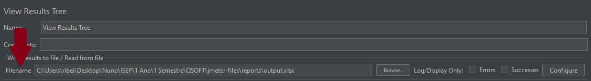

After the finalization of the test is necessary to execute the following command:

```bash
jmeter -g {output_file} -o {folder_to_generate_dasshboard.xls}
```

Finally is possible to get a web dashboard. This report is located on the folder ./reports.
