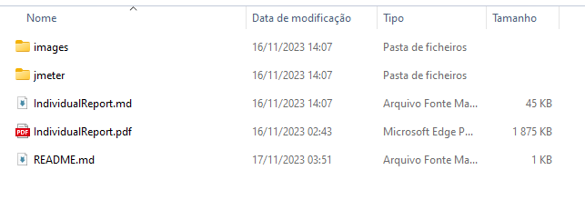

# Global report - group 103

### Masters in Informatics Engineering - 2023/24

**Students:**

-   Simão Santos (1230212@isep.ipp.pt)
-   Nuno Ribeiro (1230201@isep.ipp.pt)
-   Rui Neto (1230211@isep.ipp.pt)

## Contents

---

-   [List of figures](#list_of_figures)
-   [1. Introduction](#introduction)
-   [2. Context](#context)
    -   [2.1. Functionalities](#functionalities)
    -   [2.2. Architecture](#architecture)
        -   [2.2.1. Components diagram](#components_diagram)
        -   [2.2.2. Implementation diagram](#implementation_diagram)
        -   [2.2.3. Sequence diagrams](#sequence_diagrams)
        -   [2.2.4. DDD Model](#ddd_model)
    -   [2.3. Conventions](#context_conventions)
        -   [2.3.1. Naming conventions](#naming_conventions)
        -   [2.3.2. Package conventions](#package_conventions)
        -   [2.3.3. Architectural conventions](#architectural_conventions)
-   [3. Work distribution](#work_distribution)
-   [4. Technologies](#technologies)
    -   [4.1. ArchUnit](#archunit)
    -   [4.2. OWASP Dependency-Check](#dependency_check)
    -   [4.3. JMeter](#jmeter)
    -   [4.4. flaky-test-extractor-maven-plugin](#flaky_test_extractor_maven_plugin)
    -   [4.5. JNose](#jnose)
    -   [4.6. SonarGraph](#sonargraph)
-   [5. Conventions](#conventions)
-   [6. Goal Question Metric](#goal_question_metric)
    -   [6.1. Plan](#plan)
    -   [6.2. Answering questions](#answeing_questions)
    -   [6.3. Analysing goal](#analysing_goal)
-   [7. Conclusion](#conclusion)
-   [References](#references)

## List of figures 

---

-   [Figure 1 - Components Diagram](#component_diagram)
-   [Figure 2 - Implementation Diagram](#implementation_diagram)
-   [Figure 3 - Sequence Diagram - Add Person to Group](#sequence_diagram_add_person_to_group)
-   [Figure 4 - Sequence Diagram - Create Person](#sequence_diagram_create_person)
-   [Figure 5 - Sequence Diagram - Create Transaction](#sequence_diagram_create_transaction)
-   [Figure 6 - DDD Model](#ddd_model)
-   [Figure 7- Project Structure](#project_structure)
-   [Figure 8 - QGM Plan](#gqm_plan)

## 1. Introduction 

---

This document serves as a global report for the first part of the QSOT project. The focus is to address aspects related to software quality and how to leverage the goal question metric approach (GQM) to accomplish an effective measurement.

## 2. Context 

---

The project under analysis was originally available at https://github.com/miguelemos/ddd-domain-driven-design/tree/master/backend/src

The company QSOFT aims to develop an innovative communication platform named XPTO, designed to provide users with a comprehensive experience encompassing text, voice, and video features (similar to [discord](https://discord.com/)). In an effort to enhance user engagement, XPTO introduces a unique points system. Users accrue points based on their activity within the application, and these points can be redeemed for exciting rewards such as avatars and special emojis. Importantly, all transactions linked to the points system must be carefully recorded on a ledger.

Recognizing the compatibility between the desired functionalities of XPTO application and a finance project already made by the company (project under analysis sourced from [here](https://github.com/miguelemos/ddd-domain-driven-design/tree/master/backend/src)), the goal is to expedite the development process by reusing the proven features related to individual user registration, group management, and ledger recording already implemented by the company.

However, crucial documentation is absent, notably details on how quality was assessed. Consequently, a decision has been made to scrutinize the project in line with contemporary requirements. This analysis will encompass various quality attributes and architectural characteristics, with the aim of gathering measurements that can serve as guidance for the team. These measurements will be instrumental in determining whether or not to use the project under analysis.

To facilitate this analysis, a goal-question metric (GQM) approach will be employed. GQM is rooted in the principle that understanding why you are measuring something is essential for effective measurement [[1]](#ref1). The hierarchical nature of the GQM model, conceptualized as a tree with the goal at the root, enables traceability from individual data points back to the overarching goal. This model provides a systematic framework for transforming goals into quantifiable and verifiable measures [[1]](#ref1). The goal in the GQM model serves as a fundamental statement that outlines the purpose, the object to be measured, the issue or topic of interest, and the point of view from which the goal is considered [[1]](#ref1). This goal-setting process is crucial as it directs attention to a specific set of measures. While the goal is often refined throughout the analysis, even an imperfect statement proves useful in capturing the essence of what needs to be measured [[1]](#ref1).

### 2.1. Functionalities 

Since this is an academic environment, only three aggregates will be considered, one for each student.

#### Ledger Aggregate

-   register transactions
-   update transactions
-   get transactions between two dates
-   get the earliest/latest transaction date
-   get account transactions
-   get account records between two dates

#### Person Aggregate

-   create person record
-   associate a account to a person
-   associate a category to a person
-   get person's detail by email
-   get person's accounts
-   get person's groups
-   get person's categories
-   get person's siblings
-   get person's groups

#### Group Aggregate

-   add person to group
-   create group account
-   create group category
-   create group with a person in charge
-   get group by denomination
-   get group admins
-   get group members
-   get group all members
-   get group ledger
-   get group accounts
-   get group categories
-   search group records
-   get groups that are family

### 2.2. Architecture 

#### 2.2.1. Components diagram 

In order to help analyze the current system, a component diagram was created so that the communication between the system's components could be observed.

|  |
|:-----------------------------------:|
|    Figure 1 - Components Diagram    |

As can be seen in the component diagram above, the system makes use of the Dependency Inversion Principle (DIP), since the "Service" component defines the repository interface and the implementation is responsibility of the persistence layer components. In turn, the application is exposed via a REST API in the "Controller" responsibility. It can also be seen that the system in question uses an H2 database via the Jakarta Persistence (JPA) driver. Given that the system uses Domain Driven Design (DDD), it is notable that mappers are used to convert data in the persistence layer.

From an overview of the component diagram, it is possible to identify the architecture as one that respects certain quality attributes, namely extensibility, through the use of the DIP principle, and also the principle of single responsibility, through the use of a DDD architecture.

#### 2.2.2. Implementation diagram 

In order to show the layout and organization of the packages from a project implementation perspective, the diagram below was developed. It shows the project's packages and their dependencies.

|  |
|:----------------------------------------:|
|    Figure 2 - Implementation Diagram     |

#### 2.2.3. Sequence Diagrams 

#### Add Person to Group

|  |
|:------------------------------------------------------:|
|   Figure 3 - Sequence Diagram - Add Person to Group    |

#### Create Person

|  |
|:------------------------------------------------:|
|   Figure 4 - Sequence Diagram - Create Person    |

#### Create Transaction

|  |
|:-----------------------------------------------------:|
|   Figure 5 - Sequence Diagram - Create Transaction    |

#### 2.2.4. DDD Model 

|  |
|:---------------------:|
| Figure 6 - DDD Model  |

Sourced from [base repository](https://github.com/miguelemos/ddd-domain-driven-design/blob/master/diagrams/DDD.png)

### 2.3. Conventions 

These conventions represent the established naming and structuring guidelines for different elements within the adopted project:

#### 2.3.1. Naming conventions 

**Packages:** Use of camelCase.

**Service Classes:** PascalCase with "Service" as a suffix.

**Controller Classes:** Suffix "ControllerREST".

**Repositories:** Suffix "Repository".

**JPA Repositories:** Suffix "JPARepository".

**Repository Interfaces:** Start with an 'I' and suffix "Repository".

**Methods:** Use of camelCase.

**DTO Classes:** Suffix "DTO".

**Exceptions:** Suffix "Exception".

**JPA Data Models:** Suffix "JPA".

**Tests:** Suffix "Test".

**Identifier Attributes:** Suffix "ID".

#### 2.3.2. Package conventions 

Packages inside `project` are divided in layers.
Each one have the related to the layer packages inside.

#### 2.3.3. Architectural Conventions 

Domain-Driven Design (DDD).

Layered Architecture.

Repository Pattern.

## 3. Work distribution 

---

**Simão Santos:** Accountable for:

-   **Ledger** Aggregate
-   Define repository conventions  
-   Document system-as-is class diagram
-   Document sequence diagrams for the Ledger aggregate
-   Elaborate global report context and introduction
-   Support the use of JMeter and flaky-test-extractor-maven-plugin

**Nuno Ribeiro:** Accountable for:

-   **Person** Aggregate
-   Design system-as-is components diagram
-   Document sequence diagrams for the Person aggregate
-   Support the use of JNose and SonarGraph

**Rui Neto:** Accountable for:

-   **Group** Aggregate
-   Design system-as-is package diagram
-   Document sequence diagrams for the Group aggregate
-   Elaborate global report project conventions
-   Support the use of ArchUnit and OWASP Dependency-Check

## 4. Technologies 

---

This section aims to introduce and explain the reasons behind using specific tools that facilitated the process of measuring software quality.

### 4.1. ArchUnit 

ArchUnit’s main focus is to automatically test architecture and coding rules, using any plain Java
unit testing framework. There are several tools that offer a user-friendly method for defining rules, such as specifying
that packages containing '...service...' should not access packages containing '...controller...'.
Some of these tools, like AspectJ, allow us to define more powerful rules, for instance, stating that subclasses
of class A annotated with @X can only access methods annotated with @Y.

However, each tool has its limitations, especially as rules become more intricate. Limitations could
range from the inability to specify a pointcut that applies only to interfaces in AspectJ to the absence of back
references within pointcuts. Certain tools may not even support defining complex rules, as seen in AspectJ.
Additionally, users might need to familiarize themselves with a new language or utilize different infrastructure
to enforce these rules. [[2]](#ref2)

ArchUnit aims to elevate this convenience to the level of code structures rather than simple classes. It offers
predefined methods for testing standard cases, like package dependencies, but is also highly extensible.
ArchUnit allows the creation of custom rules where imported classes can be accessed similarly to using
reflection. [[2]](#ref2)

Importantly, ArchUnit:

-   Requires no special infrastructure.
-   Requires no new language.
-   It is plain Java.
-   Rules can be evaluated with any unit testing tool.

### 4.2. OWASP Dependency-Check 

[Dependency-Check](https://github.com/jeremylong/DependencyCheck) is a Software Composition Analysis
(SCA) tool that attempts to detect publicly
disclosed vulnerabilities contained within a project’s dependencies.
Dependency-check automatically updates itself using the NVD Data Feeds hosted by NIST. [[3]](#ref3)

In addition, it's very simple to utilize and can be used as a stand-alone plug-in or as part
of the site plug-in.
Due to its recently commits, it’s easy to verify that it is a real time tool, and the
creators are still supporting it. This make the OWASP Dependency-Check a very reliable option.

### 4.3. JMeter 

All students unanimously chose the [JMeter](https://jmeter.apache.org/) tool for performance measurement, primarily because it excels at operating on the protocol level, specifically facilitating testing for HTTP services [[4]](#ref4). This decision was motivated by various compelling factors, including the tool's straightforward installation and configuration, diverse testing capabilities, platform independence, and its open-source license.

Also, one significant factor is JMeter's reputation as a well-maintained and actively supported tool, substantiated by its extensive community contributions, which have already surpassed the 18,000 mark. Additionally, the tool's resilience and currency are underscored by its most recent release on July 10, 2023, as observed on November 17, 2023.

### 4.4. flaky-test-extractor-maven-plugin 

The use of the [flaky-test-extractor-maven-plugin](https://github.com/zeebe-io/flaky-test-extractor-maven-plugin) was motivated by the need of identifying flaky tests, a common challenge in test diagnostics. Given that the project under consideration is built on the Maven framework, the selection of a Maven plugin was a seamless and logical choice.
While exploring potential solutions, alternative dependencies, such as [DeFlaker](https://github.com/gmu-swe/deflaker), were under consideration. Despite the viability of DeFlaker, the decision ultimately leaned towards the flaky-test-extractor-maven-plugin. The key determining factor in this choice was the plugin's more recent contributions.

### 4.5. JNose

[JNose Test]("https://jnosetest.github.io/index.html) is a tool introduced used to automate the detection of test smells in software projects and to collect code coverage metrics, and the selection of JNose as the smell test tool is anchored in the findings of the referenced paper [[5]](#ref5). This paper evaluates 21 tools specifically designed for identifying test smells. Notably, JNose emerges as the most recent tool in this analysis, and we consider important to have up-to-date tools in our work. Additionally, the paper ranks JNose as the second-best tool among the 18 analyzed for detecting the highest number of test smells in passing tests. Combining with all that, JNose supports a user interface what translates in a more efficient way of using this tool.

### 4.6. SonarGraph

[Sonargraph]("https://www.hello2morrow.com/products/sonargraph") is a powerful tool used in software development to analyze the quality of code.

The choice of this tool is focused on the fact that Sonargraph it's well-known and trusted in the industry, and with some search it was possible to confirm that the community support is considerable, offering helpful tutorials and clear documentation. The added bonus of a free license makes it easy to get started without any costs, and another important point is the user interface given, which it's simple and intuitive, making the work more straightforward.

## 5. Conventions 

---

#### Git conventions

In adherence to Git conventions, the group members adopted the strategy of creating a branch named 'part1' as the starting point. From this main branch, individual branches were established for the documentation of each student, named 'docs/student_number'. Additionally, a branch titled 'architectural_compliance' was specifically created for the implementation of architectural fitness functions.

Regarding commit messages, a systematic approach was followed. When a commit was linked to an issue, the commit message included the issue tag. If necessary, the keyword 'close' was incorporated to automatically close the associated issue on Bitbucket, streamlining the issue tracking process.

#### Project structure

To enhance project organization with a more linear structure, the group collectively opted for a standardized folder arrangement within each individual's directory. Within each member's directory, two subdirectories were introduced: an 'images' directory housing images pertinent to the individual report, and a 'jmeter' directory containing both the test file and the collected data from performance testing. This approach ensures a consistent and streamlined layout for ease of navigation and clarity across all personal folders.

To make it easier to understand, we present an example below:

|  |
|:-----------------------------------:|
|    _Figure 7- Project Structure_    |

#### Work flow and meetings

The group established a set of practices and agreed-upon norms for organizing and conducting meetings.

Between November 6 and 16, the group convened daily. The meetings were scheduled for 30 minutes each night, from midnight until 00:30. The primary objectives of these meetings were to facilitate the exchange of information among team members and collaboratively address any potential blockers. This structured approach ensured regular communication, fostering a proactive and cohesive team environment.

#### Architectural compliance tests

All files crafted for testing the architectural compliance of the system are neatly organized within the 'test.java.architecturalCompliance' package following the already established project conventions.

## 6. Goal Question Metric 

---

### 6.1. Plan 

|  |
|:--------------------------:|
|    Figure 8 - GQM Plan     |

### 6.2. Answering questions 

The group has unanimously agreed that for a key aspect to be deemed acceptable, all individual elements must attain an acceptable level within their respective aggregates. Therefore, if one or more aggregates receive an evaluation of "not acceptable," the overall decision is rendered as not acceptable.

####  What is the production code maintainability?

| Aggregate | Author       | Is acceptable? |
|-----------|--------------|----------------|
| Ledger    | Simão Santos | No             |
| Group     | Rui Neto     | No             |
| Person    | Nuno Ribeiro | Yes            |

Considering the comprehensive evaluations from all group members, which collectively indicate that
the maintainability of the system's production code does not meet acceptable standards, it can be inferred
that the overall maintainability of the production code is inadequate within the context of the XPTO application.

####  What is the test code maintainability?

Flaky Tests

As the execution of flaky tests is approached holistically, individual students did not specifically address this aspect. Following the successful setup of the flaky-test-extractor plugin within the project and the subsequent execution of the command nvm flaky-test-extractor:extract-flaky-tests, it is noteworthy that the plugin did not identify any flaky tests in the project.

| Aggregate | Author       | Is acceptable? |
|-----------|--------------|----------------|
| Ledger    | Simão Santos | No             |
| Group     | Rui Neto     | No             |
| Person    | Nuno Ribeiro | No             |

Considering the comprehensive evaluations from all group members, which collectively indicate that
the maintainability of the system's test code does not meet acceptable standards, it can be inferred
that the overall maintainability of the test code is inadequate within the context of the XPTO application.

#### What are the system's security problems?

| Aggregate | Author       | Is acceptable? |
|-----------|--------------|----------------|
| Ledger    | Simão Santos | No             |
| Group     | Rui Neto     | No             |
| Person    | Nuno Ribeiro | No             |

Given that all group members' evaluations collectively indicate that the system's security falls short of acceptable standards, we can conclude that the overall security is not suitable in the context of the XPTO application.

####  Does the system consistently follow architectural principles?

| Aggregate | Author       | Is acceptable? |
|-----------|--------------|----------------|
| Ledger    | Simão Santos | No             |
| Group     | Rui Neto     | No             |
| Person    | Nuno Ribeiro | No             |

Given that all group members' evaluations collectively indicate that the system's architectural principles 
falls short of acceptable standards, we can conclude that the overall architectural principles are not suitable in 
the context of the XPTO application.

####  What is the system's performance?

| Aggregate | Author       | Is acceptable? |
|-----------|--------------|----------------|
| Ledger    | Simão Santos | No             |
| Group     | Rui Neto     | No             |
| Person    | Nuno Ribeiro | No             |

Given that all group members' evaluations collectively indicate that the system's performance falls short of acceptable standards, we can conclude that the overall performance is not suitable in the context of the XPTO application.

### 6.3. Analysing goal 

Based on the comprehensive analysis conducted, including the responses to the GQM questions, we can address the overarching goal of evaluating the software's reusability within the scope of the XPTO application. Considering the critical quality attributes, namely maintainability of production/test code, performance, security, architectural compliance, and adequacy of testing, the verdict is that the software is not deemed reusable.

## 7. Conclusion 

---

In conclusion, this global report provides a comprehensive overview of the analysis conducted by Group 103 on the QSOT project, specifically focusing on the first part of the project. The team diligently explored various aspects, including functionalities, architecture, conventions, work distribution, and technologies employed. The adoption of a goal-question-metric (GQM) approach allowed for a structured evaluation of the software's quality attributes, addressing critical aspects such as performance, security, architectural compliance, and testing adequacy. The results of the evaluations collectively indicate that the system does not meet acceptable standards in key aspects, leading to the conclusion that the software is not deemed reusable within the scope of the XPTO application. Issues identified across aggregates, including performance, security vulnerabilities, and architectural concerns, contribute to the overall decision that the software lacks the necessary qualities for successful reuse.

## References 

---

**[1]** Ciceri, C., Farley, D., Ford, N., Harmel-Law, A., Keeling, M., Lilienthal, C., Rosa, J., Von Zitzewitz, A., Weiss, R., & Woods, E. (2022b). Software Architecture Metrics. O’Reilly Media.

**[2]** Gafert, P. (n.d.). Unit test your Java architecture. ArchUnit. https://www.archunit.org/

**[3]** OWASP Dependency-Check | OWASP Foundation. (n.d.). https://owasp.org/www-project-dependency-check/

**[4]** Apache JMeter - Apache JMeterTM. (n.d.). https://jmeter.apache.org/

**[5]** W. Aljedaani et al., “Test Smell Detection Tools: A Systematic Mapping study,” Evaluation and Assessment in Software Engineering, Jun. 2021, doi: 10.1145/3463274.3463335.
