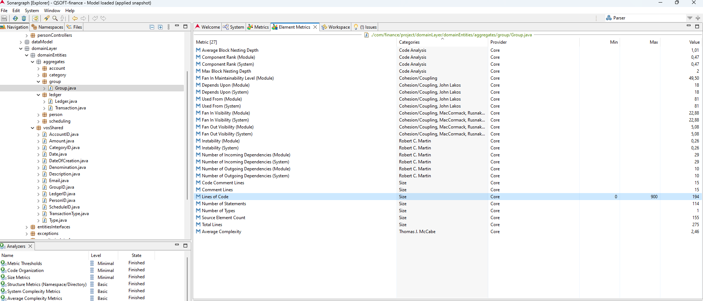
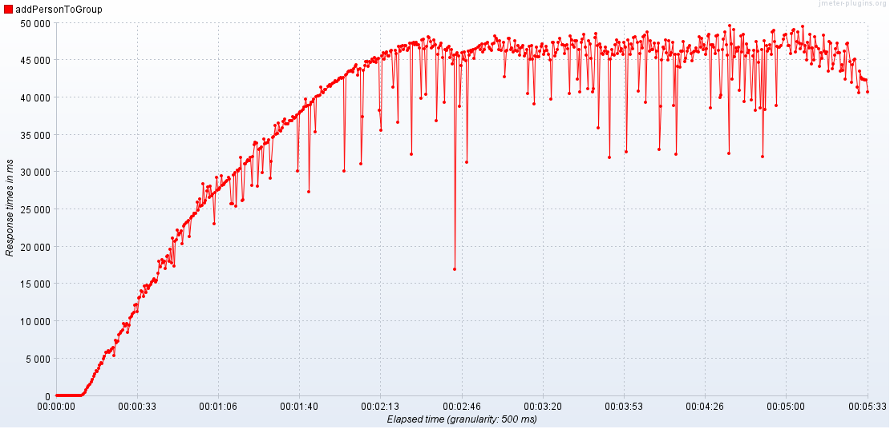
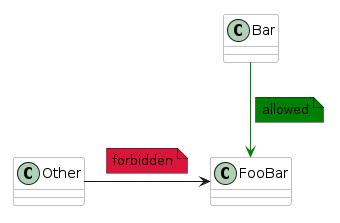

# IndividualReport #

# Developed by Rui Neto (1230211)

This folder includes all artifacts developed for the First Part of QSOFT Project. 

It is structured as follows:

## Contents
* [List of Figures](#listOfFigures)
* [1. Introduction](#introduction)
    * [1.1. Sequence diagrams of Group aggregate](#p11)
        * [1.1.1. Add Person to Group](#p111)
        * [1.1.2. Create Group as Person in charge](#p112)
* [2. Maintainability](#maintainability)
    * [2.1. Depends Upon metric](#p21)
    * [2.2. Cumulative Component Dependency (CCD) - Manually](#p22)
    * [2.3. Cumulative Component Dependency (CCD) - SonarGraph Result (Whole Project)](#p23)
    * [2.4. Lines Of Code (LoC) per class](#p24)
    * [2.5. Number of methods per class](#p25)
* [3. Performance](#performance)
    * [3.1. Add Person to Group](#p31)
        * [3.1.1. Scenario 1](#p311)
        * [3.1.2. Scenario 2](#p312)
        * [3.1.3. Conclusion](#p313)
* [4. Security](#security)
    * [4.1. Dependency vulnerability analyses](#p41)
    * [4.2. Class analyses](#p42)
        * [4.2.1. Group.java](#p421)
        * [4.2.2. GroupID.java](#p422)
        * [4.2.3. DateOfCreation.java](#p423)
        * [4.2.4. All Results](#p424)
* [5. Architectural compliance](#architecturalCompliance)
    * [5.1. Package Dependency Check](#p51)
    * [5.2. Class Dependency Check](#p52)
* [6. Maintainability of test code](#maintainabilityOfTestCode)
    * [6.1. Test Smells](#p61)
        * [6.1.1. GroupTest.java](#p611)
        * [6.1.2. AddPersonToGroupControllerRESTTest.java](#p612)
        * [6.1.3. CreateGroupServiceTest.java](#p613)
* [7. Conclusions](#conclusions)
* [References](#references)
* [Appendices](#appendices)
    * [Appendix 1 - CSV Generator Code](#appendix1)

<div style="page-break-after: always;"></div>

## <a name="listOfFigures"></a>List of Figures

* [Figure 1- Domain Model](#f1)
* [Figure 2- Sequence Diagram - Add Person to Group](#f2)
* [Figure 3- Sequence Diagram - Create Group as Person in charge](#f3)
* [Figure 4- Depends Upon Metric](#f4)
* [Figure 5- CCD - SonarGraph Result](#f5)
* [Figure 6- LoC of Group.java](#f6)
* [Figure 7- Persons CSV Config File JMeter](#f7)
* [Figure 8- Formal Scenario 1](#f8)
* [Figure 9- Load Test - Steady Ramp Up](#f9)
* [Figure 10- Load Test Result - Response Time](#f10)
* [Figure 11- Load Test Result - Average Response Time](#f11)
* [Figure 12- Soak Test - Steady Ramp Up](#f12)
* [Figure 13- Soak Test Result - Response Time](#f13)
* [Figure 14- Soak Test Result - Average Response Time](#f14)
* [Figure 15- Formal Scenario 2](#f15)
* [Figure 16- Stress Test - Steady Ramp Up](#f16)
* [Figure 17- Stress Test Result - Latency](#f17)
* [Figure 18- Stress Test Result - Average Latency](#f18)
* [Figure 19- Dependency Analyses - pkg:maven/com.h2database/h2@1.4.200](#f19)
* [Figure 20- Dependency Analyses - vulnerabilities](#f20)
* [Figure 21- Package Dependency Checks Example](#f21)
* [Figure 22- Class Dependency Checks Example](#f22)
* [Figure 23- Test smells - GroupTest.java](#f23)
* [Figure 24- Test smells - AddPersonToGroupControllerRESTTest.java](#f24)
* [Figure 25- Test smells - CreateGroupServiceTest.java](#f25)

<div style="page-break-after: always;"></div>

## <a name="introduction"></a>1. Introduction

The present report is the outcome of the practical work proposed in the course subject QSOFT 
of the first year of the Master's in Software Engineering at ISEP.

It is also the result of a comprehensive test of the ```Group``` aggregate in a Web App
designed for Personal Finance Management, that can be found
[here](https://github.com/miguelemos/ddd-domain-driven-design), to see if it is reusable in the context of another application.

In this application, an individual is characterized by a name, address, birthdate, birthplace, 
maternal and paternal details, as well as siblings. 
Individuals can congregate into **Groups** (e.g., families), each having administrators, 
a description, a creation date, and a Ledger. It is compulsory to record the financial transactions 
of both individuals and Groups in a Ledger.

The primary objective here is to test the talked before Group aggregate to see if the application
is reusable within the scope of another application.

To enhance the understanding of the group's objectives, we present the following domain model diagram.
In this diagram, the class highlighted in red represents the aggregate under evaluation.

<a name="f1"></a>

|  | 
|:-----------------------------:| 
|   *Figure 1- Domain Model*    |

<div style="page-break-after: always;"></div>

### <a name="p11"></a>1.1. Sequence diagrams of Group aggregate

In the dynamic landscape of software development and system analysis, the ability to comprehend 
and communicate complex interactions is paramount. 
One powerful tool that facilitates this understanding is the sequence diagrams. 

In the next steps, it will be possible to see sequence diagrams for creating a group 
and for adding a person to a group.

#### <a name="p111"></a>1.1.1. Add Person to Group

<a name="f2"></a>

|                  | 
|:--------------------------------------------------:| 
| *Figure 2- Sequence Diagram - Add Person to Group* |

<div style="page-break-after: always;"></div>

#### <a name="p112"></a>1.1.2. Create Group as Person in charge

<a name="f3"></a>

|                    | 
|:---------------------------------------------------------------:| 
| *Figure 3- Sequence Diagram - Create Group as Person in charge* |

<div style="page-break-after: always;"></div>

## <a name="maintainability"></a>2. Maintainability

_Use of Sonargraph_

Sonargraph is a comprehensive software architecture and quality management tool designed to help 
 maintain high-quality, maintainable, and scalable codebases. 
As a robust platform, Sonargraph offers a range of features that contribute to measure code quality, 
early detect issues, and enhance architectural understanding. 

In this case, Sonargraph was used to get the Cumulative Component Dependency of the whole project, and the
LoC of the classes being evaluated.

### <a name="p21"></a>2.1. Depends Upon metric

Understanding dependencies in software development, as indicated by the "Depends Upon" metric, 
is crucial for maintaining code quality. This metric reveals how components rely on each other. 

<a name="f4"></a>

|  | 
|:-----------------------------------:| 
|   *Figure 4- Depends Upon Metric*   |

### <a name="p22"></a>2.2. Cumulative Component Dependency (CCD) - Manually

The Cumulative Component Dependency (CCD) metric is a valuable measure in software development that provides insights 
into the overall complexity and interconnectivity of the codebase. 
It quantifies the cumulative number of dependencies that a specific class has with other elements in the system. 

> A high CCD suggests a higher level of interdependence, potentially indicating greater complexity and a higher risk 
> of cascading changes when modifications are made to that component. 

```CCD = 1 + 1 + 3 + 4 + 4 + 5 = 18```

### <a name="p23"></a>2.3. Cumulative Component Dependency (CCD) - SonarGraph Result (Whole Project)

By using Sonargraph, it's easy to see that de CCD of the whole project is ```CCD = 7681```.

<a name="f5"></a>

|                | 
|:-----------------------------------:| 
| *Figure 5- CCD - SonarGraph Result* |

### <a name="p24"></a>2.4. Lines Of Code (LoC) per class

When it comes to defining thresholds in metrics, it usually involves establishing certain benchmarks
or limits to monitor the performance of our system.
These thresholds help in identifying when something is functioning as expected or when
there's an anomaly or issue that needs attention.
Lines of Code (LoC) per file counts every line that contains actual code and skips
empty lines and comment lines. [1]
Here, the thresholds were defined following the
[Code Quality](https://docs.embold.io/metrics/) website. From now on, the site will be called **CQ**.
In the following image, it is possible to see where we can find the LoC of a class using Sonargraph.
The class Group.java has 194 LoC.

<a name="f6"></a>

|     | 
|:-----------------------------:| 
| *Figure 6- LoC of Group.java* |

As seen before, it's easy to verify the Lines of Code of every single class. With this in mind,
more classes were analysed.

| Class                          | LoC |
|--------------------------------|:---:|
| Group.java                     | 194 |
| createGroupService .java       | 264 |
| CreateGroupControllerREST.java | 85  |

According to CQ, the default threshold is ```1000```. So, for these classes and this metric, 
the application is pretty maintainable.

### <a name="p25"></a>2.5. Number of methods per class

In software development, the structure and organization of code play a pivotal role in determining 
the maintainability and overall quality of the software system. One crucial aspect that directly 
influences these factors is the number of methods within each class.

| Class                          | Num of methods |
|--------------------------------|:--------------:|
| Group.java                     |       27       |
| createGroupService.java        |       15       |
| CreateGroupControllerREST.java |       8        |

According to CQ, the default threshold is ```10```. So, for these classes and this metric,
the application is not that interesting. The Group.java has almost 300% of the required 
number of methods.

**GQM - What's the maintainability of production code?**

While Lines of Code (LoC) per class are within acceptable thresholds,
the number of methods in the Group.java and createGroupService.java class exceeds recommended limits, 
suggesting a potential challenge in maintainability. 

So, considering the Group aggregate,
the system's maintainability of production code is <span style="color:red">not acceptable</span>.

<div style="page-break-after: always;"></div>

## <a name="performance"></a>3. Performance

_Use of Apache JMeter_

Apache JMeter was the tool chosen for testing the performance of the Group aggregate.
This tool stands out as a robust choice for performance testing due to its combination of features.

Its versatility spans multiple protocols, including HTTP, the one we are interested in.

Altogether, JMeter emerges as a comprehensive, accessible, and powerful solution to test the performance 
of the Group aggregate of our XPTO system.

To run the tests (command line):

```jmeter -n -t .\Part1\documentation\RuiNeto1230211\jmeter\jmeter.jmx -l ./Part1/documentation/RuiNeto1230211/jmeter/history```

To generate the dashboard with results (command line):

```jmeter -g ./Part1/documentation/RuiNeto1230211/jmeter/history/result_data.xls -o ./Part1/documentation/RuiNeto1230211/jmeter/history/{dirToSaveReport}```

### <a name="p31"></a>3.1. Add Person to Group

**Endpoint**

```
@PostMapping("/groups/{denomination}/members")
public ResponseEntity<Object> addPersonToGroupP()
```

_Use of a CSV file_ 

In conducting the performance testing analysis for the "Add Person to Group" functionality,
a structured approach was utilized employing data from a CSV file. Leveraging the CSV file allowed 
for a systematic and reproducible testing process, as the file contains a giant list of persons'
emails to add to groups.

> See Appendix 1 - CSV Generator Code.

The CSV file is located in ```./jmeter/persons.csv```.

After the creation of the CSV file, it was added to the JMeter tests by using the functionality "Config
File". The addition is shown below.

<a name="f7"></a>

|                | 
|:------------------------------------------:| 
| *Figure 7- Persons CSV Config File JMeter* |

Thanks to this approach, we just needed to add ```{"email":${email}}``` to the request body.

#### <a name="p311"></a>3.1.1. Scenario 1

_Raw Scenario_

The system must process and respond to requests for adding persons to groups 
with an average response time of less than 2 seconds under the expected user load of 300.

_Formal Scenario_

<a name="f8"></a>

|  | 
|:-------------------------------------------------:| 
|           *Figure 8- Formal Scenario 1*           |

_Image adaptation from [2]._

**Load Test**

_Steady Ramp-Up:_

In this pattern, the number of virtual users is increased gradually and steadily over time until
it reaches the desired load level.
This pattern is useful for testing our system because it's possible we experience a
large number of visitors during the start of the day, and maintain a more regular number
during the day.
Here, we should simulate a gradual increase in
traffic over time, instead of a sudden spike.

<a name="f9"></a>

|  | 
|:-----------------------------------------------------------:| 
|           *Figure 9- Load Test - Steady Ramp Up*            |

_Results:_

In the image below it is possible to see that, even before the 30-second mark, 
the response time was already well over 2 seconds.

<a name="f10"></a>

|  | 
|:-----------------------------------------------------------------:| 
|           *Figure 10- Load Test Result - Response Time*           |

Now, in the image below, it's possible to see that the average response time 
after two minutes is over 45 seconds.

<a name="f11"></a>

|  | 
|:------------------------------------------------------------------------:| 
|          *Figure 11- Load Test Result - Average Response Time*           |

From this we find that the system needs a whole refactor in adding a person to a group.
This can be critical because if these are the results from a load test, a soak test will 
probably be worst performed. It is documented below.

**Soak test**

_Steady Ramp-Up:_

<a name="f12"></a>

|  | 
|:-----------------------------------------------------------:| 
|           *Figure 12- Soak Test - Steady Ramp Up*           |

_Results:_

The following image shows that, as soon as the test starts the 
response time was already over the expected.

<a name="f13"></a>

|  | 
|:-----------------------------------------------------------------:| 
|           *Figure 13- Soak Test Result - Response Time*           |

Now, in the following one, it's possible to see that the average response time
after 10 minutes is over 45 seconds, which is horrible for a common user to deal with in their 
stressful day.

<a name="f14"></a>

|  | 
|:------------------------------------------------------------------------:| 
|          *Figure 14- Soak Test Result - Average Response Time*           |

From this view, we know that the system needs to be adapted to support a long period of requests 
in the context of adding a person to a group.

#### <a name="p312"></a>3.1.2. Scenario 2

_Raw Scenario_

The system must support the addition of persons to groups during a period of load increase
equivalent to 200%, with a latency lower than 2 seconds.

<div style="page-break-after: always;"></div>

_Formal Scenario_

<a name="f15"></a>

|  | 
|:-------------------------------------------------:| 
|          *Figure 15- Formal Scenario 2*           |

**Stress test**

_Steady Ramp-Up:_

<a name="f16"></a>

|  | 
|:-------------------------------------------------------------:| 
|           *Figure 16- Stress Test - Steady Ramp Up*           |

<div style="page-break-after: always;"></div>

_Results:_

In the image below it is possible to see that the system is not prepared for an overload of users.
At 30 seconds, the latency was already over 10 seconds. This is 5 times more than the acceptable for an
operation like this.

<a name="f17"></a>

|  | 
|:--------------------------------------------------------------:| 
|           *Figure 17- Stress Test Result - Latency*            |

<a name="f18"></a>

|  | 
|:---------------------------------------------------------------------:| 
|           *Figure 18- Stress Test Result - Average Latency*           |

Here, we find that the system is not ready for an overload of users. In this case we doubled
them, which is a very real scenario, for example, in the popular events where people spend more money 
and must use the system more.

<div style="page-break-after: always;"></div>

#### <a name="p313"></a>3.1.3. Conclusion

The analysis of the "Add Person to Group" functionality reveals critical shortcomings in the system's 
performance under various scenarios. The load test indicates that even under a steady ramp-up of users, 
the response time exceeded the acceptable threshold of 2 seconds within the initial 30 seconds, 
and after 2 minutes, the average response time skyrocketed to over 45 seconds.

The soak test, designed to simulate a sustained period of activity, exposed alarming results. 
Within the first moments, the response time surpassed expectations, and after 10 minutes, 
the average response time reached an unacceptable 45 seconds mark. 
This highlights the urgent need for a comprehensive refactor to enhance the system's capability 
to handle a prolonged influx of requests during the process of adding a person to a group.

In the stress test scenario, where a 200% increase in load was simulated, 
the system demonstrated a notable struggle - it is not ready for an overload of users.
This underscores the system's unpreparedness for 
handling significant spikes in user activity, a situation likely to occur during popular events or 
high-demand periods.

**GQM - What's the system's performance?**

So, considering the Group aggregate, the system's performance is 
<span style="color:red">not acceptable</span>.

<div style="page-break-after: always;"></div>

## <a name="security"></a>4. Security

### <a name="p41"></a>4.1. Dependency vulnerability analyses

Ensuring the security of our system is paramount in today's digital 
landscape, where cyber threats are ever-evolving. One critical aspect of 
this security landscape is the thorough examination of dependencies within 
the system stack. In this context, the OWASP Dependency-Check tool emerges 
as a valuable asset, offering a systematic approach to identify and mitigate 
potential vulnerabilities in dependencies.

This point focuses on the use of the OWASP Dependency-Check tool in scrutinizing 
the `pkg:maven/com.h2database/h2@1.4.200` dependency. 

To run the dependency checker, we used the command
```mvn org.owasp:dependency-check-maven:check```.

Specifically into the evaluation of vulnerabilities associated 
with this version of the H2 database through the lens of the OWASP Dependency-Check,
this examination becomes instrumental in fortifying our software against 
potential security risks.

<a name="f19"></a>

|                                  | 
|:----------------------------------------------------------------------:| 
| *Figure 19- Dependency Analyses - pkg:maven/com.h2database/h2@1.4.200* |

* Highest Severity:

The severity level of the highest-rated vulnerability associated with each dependency. 
Severity levels typically range from low to critical, helping prioritize 
the resolution of security issues based on their potential impact.

* CVE Count:

This represents the total number of CVEs (Common Vulnerabilities and Exposures) 
associated with each dependency.

* Confidence:

The confidence level expresses the degree of certainty that the identified vulnerability is 
present in the dependency. A higher confidence level indicates a greater degree of certainty.

* Evidence Count:

Indicates the number of pieces of evidence or indicators that led to the identification of 
vulnerabilities in a particular dependency.

The **National Vulnerability Database (NVD)** provides a comprehensive overview of vulnerabilities, 
and in this case, we are examining the vulnerabilities associated with the H2 database version 1.4.200. 

Taking a
[look](https://nvd.nist.gov/vuln/search/results?form_type=Advanced&results_type=overview&search_type=all&cpe_vendor=cpe%3A%2F%3Ah2database&cpe_product=cpe%3A%2F%3Ah2database%3Ah2&cpe_version=cpe%3A%2F%3Ah2database%3Ah2%3A1.4.200)
at the NVD, it's possible to see that this dependency has a lot of critical aspects.

The vulnerabilities listed in the NVD for this specific version of the H2 database highlight the following 
potential security concerns that may affect systems relying on this database version.

<a name="f20"></a>

|  | 
|:------------------------------------------------------:| 
|   *Figure 20- Dependency Analyses - vulnerabilities*   |

With this mind, it's clear that the system needs an urgent upgrade 
to a more recent version to ensure the benefits from the latest 
security patches and enhancements.

Looking at the [MVN Repository](https://mvnrepository.com/artifact/com.h2database/h2), it's easy to find that these versions have no vulnerabilities:

* 2.2.224 
* 2.2.222 
* 2.2.220  

### <a name="p42"></a>4.2. Class analyses

The following table has been defined with the aim of making the evaluation of the data inputs of the 
classes more coherent.

| Measurement | Rational                                                            |
|:-----------:|---------------------------------------------------------------------|
|      1      | No validations                                                      |
|      2      | Has validations only in terms of technical perspective*             |
|      3      | Has validations only in terms of technical and domain perspective** |

> *Technical perspective: The software checks for validations in terms of java compilation errors, e.g., 
> check if the instance is not null, the list doesn't contain null values, etc., but ignores the domain 
> validation, an email's String has the same treatment as an address' String.
>
> **Domain perspective: In addition to technical validations, the software checks for validations in 
> terms of the domain, e.g, if the email is on the expected format.

<div style="page-break-after: always;"></div>

#### <a name="p421"></a>4.2.1. Group.java

The Group.java class incorporates technical validations by checking for null values in critical 
parameters during the creation of a Group instance. For instance, it verifies that the personInCharge 
parameter and the members are not null. However, there is room for improvement as it does not verify 
if the description, for example, is null.

So, the class falls under 1. It's worth noting that the class has other constructive elements, 
such as encapsulation through private fields and methods, proper use of constructors, 
and adherence to good practices like creating immutable objects.

```java
public class Group implements Entity, Owner {
    private Group(String denomination, List<PersonID> peopleInCharge, List<PersonID> members,
                  String description, LocalDate dateOfCreation, LedgerID ledgerID) {

        if (peopleInCharge == null) {
            throw new NullPointerException("Group not created. People in charge can't be Null");
        } else {
            this.peopleInCharge = peopleInCharge;
        }

        if (members == null) {
            throw new NullPointerException("Group not created. Members can't be Null");
        } else {
            this.members = members;
        }
        
        this.description = Description.createDescription(description);
        this.dateOfCreation = DateOfCreation.createDateOfCreation(dateOfCreation);
        this.groupID = GroupID.createGroupID(denomination);
        this.ledgerID = ledgerID;
    }
}
```

<div style="page-break-after: always;"></div>

#### <a name="p422"></a>4.2.2. GroupID.java

The GroupID.java class performs technical validations during the creation of a GroupID instance. 
It checks if the denomination parameter is null or an empty string, and throws an 
IllegalArgumentException if the condition is met. 

This ensures that a GroupID is created with a valid Denomination. This aligns with both criteria 
of having technical and domain validations.

```java
public class GroupID implements OwnerID, ValueObject, Serializable {
    private GroupID(String denomination) {
        
        if (denomination == null || denomination.equals("")) {
            throw new IllegalArgumentException("GroupID not created. The denomination parameter " +
                    "can't be null or a empty string");
        } else {
            this.denomination = Denomination.createDenomination(denomination);
        }
    }
}
```

#### <a name="p423"></a>4.2.3. DateOfCreation.java

The constructor performs a technical validation by checking if the dateOfCreation parameter is null. 
If it is null, an IllegalArgumentException is thrown. This ensures that a valid LocalDate is 
provided during the creation of a DateOfCreation instance.

But it doesn't verify if the data is empty, so it's possible to verify that the class doesn't respond to 
the domain perspective, where a valid date should be mandatory.

```java
public class DateOfCreation implements ValueObject, Serializable {
    private DateOfCreation(LocalDate dateOfCreation) {
        
        if (dateOfCreation == null) {
            throw new IllegalArgumentException("DateOfCreation not created due to the fact that the " +
                    "dateOfCreation parameter hasn't a valid argument");
        }
        
        this.dateOfCreation = dateOfCreation;
    }
}
```

<div style="page-break-after: always;"></div>

#### <a name="p424"></a>4.2.4. All Results

The following table shows the result of the 7 classes chosen to evaluate.

| Class               | Evaluation |
|---------------------|:----------:|
| Group.java          |     1      |
| LedgerID.java       |     1      |
| PersonID.java       |     2      |
| DateOfCreation.java |     2      |
| AccountID.java      |     2      |
| GroupID.java        |     3      |
| ScheduleID.java     |     3      |

**GQM - What are the system's security problems?**

Pointing to the security analysis using the OWASP Dependency-Check tool for the H2 database
and the examined classes, both has revealed critical vulnerabilities,
which is not good point for the reuse of the system.

So, considering the Group aggregate, the system's security problems are
<span style="color:red">not acceptable</span>.

<div style="page-break-after: always;"></div>

## <a name="architecturalCompliance"></a>5. Architectural compliance

Architectural compliance is a critical aspect of software development and maintenance, ensuring that 
the implemented architecture aligns with the intended design principles and organizational standards. 
This process involves continuously monitoring and validating the codebase and system against the 
established architectural specifications.

_Use of ArchUnit_

ArchUnit is a simple but powerful open-source library to automatically test Java
architectures as plain unit tests. [3]
As a unit testing framework, ArchUnit enabled to 
define and execute tests that check **package and class** dependencies.

### <a name="p51"></a>5.1. Package Dependency Check

**Fitness Function** 

* **Breadth of feedback:** Holistic (will target the whole system)
* **Execution trigger:** Periodical and in the test environment
* **Metric type:** Binary 
    * True: The system complies with the conventions about Package Dependency.
    * False: The system doesn't comply with the conventions about Package Dependency. 
* **Automated:** No
* **Quality attribute requirements:** Maintainability
* **Static or dynamic:** Static

The following image is useful to understand how the tests works. In the required case, we tested if the
```groupControllers```, ```personControllers``` and ```otherControllers``` packages depend on classes 
that resides in the ```appllicationServices``` or ```dtos``` packages.

<a name="f21"></a>

|  | 
|:------------------------------------------------:| 
|  *Figure 21- Package Dependency Checks Example*  |

**Test code**

```java
public class PackageDependencyCheckTest {
    @ArchTest
    static void checkGroupControllersPackageDependencyTest(JavaClasses classes) {
        classes().that().resideInAPackage("..groupControllers..")
                .should().dependOnClassesThat().resideInAnyPackage("..applicationServices..", "..dtos..")
                .check(classes);
    }

    @ArchTest
    static void checkPersonControllersPackageDependencyTest(JavaClasses classes) {
        classes().that().resideInAPackage("..personControllers..")
                .should().dependOnClassesThat().resideInAnyPackage("..applicationServices..", "..dtos..")
                .check(classes);
    }

    @ArchTest
    static void checkOtherControllersPackageDependencyTest(JavaClasses classes) {
        classes().that().resideInAPackage("..otherControllers..")
                .should().dependOnClassesThat().resideInAnyPackage("..applicationServices..", "..dtos..")
                .check(classes);
    }
}
```

**Results**

With the tests' results, it is possible to see that the system complies with good conventions about 
the package dependency, keeping in mind that all the 3 tests passed.

However, this fitness function only cover the controllers packages dependencies. To ensure that the whole system
follows good conventions, more tests are needed.

<div style="page-break-after: always;"></div>

### <a name="p52"></a>5.2. Class Dependency Check

**Fitness Function**

* **Breadth of feedback:** Holistic (will target the whole system)
* **Execution trigger:** Periodical and in the test environment
* **Metric type:** Binary
  * True: The system complies with the conventions about Class Dependency.
  * False: The system doesn't comply with the conventions about Class Dependency.
* **Automated:** No
* **Quality attribute requirements:** Maintainability
* **Static or dynamic:** Static

The following image is useful to understand how the tests works. In the required case, we tested if the
ended with ```ControllerREST``` classes only have dependent classes ended with ```Service``` or ```DTO```.

<a name="f22"></a>

|  | 
|:----------------------------------------------:| 
|  *Figure 22- Class Dependency Checks Example*  |

**Test code**

```java
public class ClassDependencyCheckTest {
  @ArchTest
  static void checkControllersClassDependencyTest(JavaClasses classes) {
    classes().that().haveNameMatching(".*ControllerREST")
            .should().onlyHaveDependentClassesThat()
            .haveSimpleName(".*Service")
            .orShould().haveSimpleName(".*DTO")
            .check(classes);
  }
}
```

**GQM - Does the system consistently follow architectural principles?**

With the tests' results, it is possible to see that the system doesn't comply with good conventions about
the class dependency, keeping in mind that this simple test failed.
So, considering the Group aggregate,
the system's architectural principles are <span style="color:red">not acceptable</span>.

<div style="page-break-after: always;"></div>

## <a name="maintainabiltyOfTestCode"></a>6. Maintainability of test code

The term code smell indicates symptoms that may indicate deeper problems in the
system’s source code. Several studies show that
code smells hinder the comprehensibility and maintainability of software systems.
They increase the risk of bugs or failures in the future

And test code? Software testing is an essential part of the software development life
cycle. Testing code matters.

### <a name="p61"></a>6.1. Test Smells

Test smells are suboptimal design choices developers make when implementing test
cases [4].
They are prevalent in real life and damage the maintenance and comprehensibility of
the test suite [5].

The following image outlines the test smells found in certain classes within the Group aggregate.

#### <a name="p611"></a>6.1.1. GroupTest.java

<a name="f23"></a>

|          | 
|:-----------------------------------------:| 
| *Figure 23- Test smells - GroupTest.java* |

**Tests smells found:**

* 49 Assertion Roulette 
* 35 Eager Test 
* 2 Verbose Test 
* 3 Exception Catching Throwing 
* 22 Lazy Test

**Examples**:

* _Assertion Roulette_

Occurs when a test method has multiple non-documented assertions. Multiple
assertion statements in a test method without a descriptive message impact
readability/understandability/maintainability as it’s not possible to understand the
reason for the failure of the test. [6]

Detection: A test method contains more than one assertion statement without an
explanation/message (parameter in the assertion method). [6]

<div style="page-break-after: always;"></div>

```java
public class GroupTest {
    @Test
    @DisplayName("Verify if one CategoryID can be added to Categories List || Sad case: CategoryID already exist")
    public void categoryIDNotAddedToCategoriesList() {
        //...
        assertEquals(true, result1);
        assertEquals(false, result2);
        assertEquals(groupFriends.getCategories(), categories);
    }
}
```

Here, The assertEquals() method is called 3 times. Each assert statement checks for a
different condition, without an explanation message for each assert statement.
If one of the assert statements fails, identifying the cause of the failure is not simple.

* _Eager Test_

Tests are often eager as they test (entirely) unrelated functionalities.
The checking of an object’s state using multiple getter calls after some action is
rarely avoidable. [7]

If the test is cohesive enough and focuses on a single feature, the
assertions should ensure that the entire behavior is as expected. This may mean
asserting that many fields were updated and have a new value. [7]

```java
public class GroupTest {
    @Test
    @DisplayName("Verify if one CategoryID can be added to Categories List || Sad case: CategoryID already exist")
    public void categoryIDNotAddedToCategoriesList() {
        //...
        assertEquals(true, result1);
        assertEquals(false, result2);
        assertEquals(groupFriends.getCategories(), categories);
    }
}
```

This test is verifying, at the same time, if the category is successfully added and then gets all 
the categories.
Tests should not have unrelated assertions.

<div style="page-break-after: always;"></div>

* _Verbose Test_

This smell occurs when the tests use a lot of code to do what they need to do. In
other words, the test code is not clean and simple. [8]

```java
public class GroupTest {
    @Test
    @DisplayName("Get records of a account in a determined period of time (only one movement are valid due to the use of a different account)| Happy Case (different account)")
    public void testGetRecordsBetweenTwoDatesOfADeterminedAccountDebitAndCredit() {
        //100 lines of code
    }
}
```

This test has almost 100 lines of code because it's adding 4 transactions when it should do the same job 
with only 2. This makes the test maintainability harder.

#### <a name="p612"></a>6.1.2. AddPersonToGroupControllerRESTTest.java

<a name="f24"></a>

|          | 
|:------------------------------------------------------------------:| 
| *Figure 24- Test smells - AddPersonToGroupControllerRESTTest.java* |

**Tests smells found:**

* 1 Assertion Roulette 
* 1 UnknownTest

#### <a name="p613"></a>6.1.3. CreateGroupServiceTest.java

<a name="f25"></a>

|          | 
|:------------------------------------------------------:| 
| *Figure 25- Test smells - CreateGroupServiceTest.java* |

**Tests smells found:**

* 15 Assertion Roulette 
* 15 EagerTest 
* 8 VerboseTest 
* 8 LazyTest

<div style="page-break-after: always;"></div>

**GQM - What's the maintainability of test code?**

The analysis of test code maintainability reveals the presence of various test smells in the test suites for
the Group aggregate, such as Assertion Roulette, Eager Test, Verbose Test, and Lazy Test
have been identified in specific test classes.

So, considering the Group aggregate,
the system's test code maintainability is <span style="color:red">not acceptable</span>.

<div style="page-break-after: always;"></div>

## <a name="conclusions"></a>7. Conclusions

Talking about maintainability, while Lines of Code (LoC) per class are within acceptable thresholds, 
the number of methods in the Group.java class exceeds recommended limits, suggesting a potential 
challenge in maintainability. However, the application performed well in the other maintainability 
tests.

The performance testing of the "Add Person to Group" functionality
revealed critical deficiencies in the system's performance. The load, soak and stress tests showed 
that response times and latencies exceeded acceptable thresholds. These findings 
underscore for a comprehensive opinion that the system cannot be reused.

Now, pointing to the security analysis using the OWASP Dependency-Check tool for the H2 database 
and the examined classes, both has revealed critical vulnerabilities, 
which is not good point for the reuse of the application.

The Package Dependency Check tests indicate that the system currently complies with good conventions.
On the other hand, the Class Dependency Check tests highlight a deviation from conventions.

The analysis of test code maintainability reveals the presence of various test smells in the test suites for 
the Group aggregate, such as Assertion Roulette, Eager Test, Verbose Test, and Lazy Test 
have been identified in specific test classes.

After carefully weighing all the observed aspects, it is evident that the application has a 
considerable number of issues that require substantial time for resolution. This makes it an 
unsuitable reference for reuse in a different context.

So all the quality attributes tested in the Group aggregate are 
<span style="color:red">not acceptable</span>.

<div style="page-break-after: always;"></div>

## <a name="references"></a>References

**[1]** _Christian Ciceri, Dave Farley, Neal Ford, Andrew Harmel-Law, Michael Keeling, Carola Lilienthal, João Rosa, 
Alexander von Zitzewitz, Rene Weiss, and Eoin Woods. 2022. Software Architecture Metrics (1st ed.). O’Reilly Media_

**[2]** _L. Bass, P. Clements, and R. Kazman. 2021. Software Architecture in Practice (4 ed.). Addison-Wesley Professional._

**[3]** _Peter Gafert. [n.d.]. About ArchUnit. https://www.archunit.org/about_

**[4]** _Wajdi Aljedaani, Anthony Peruma, Ahmed Aljohani, Mazen Alotaibi, Mohamed Wiem Mkaouer, Ali Ouni, Christian D Newman, 
Abdullatif Ghallab, and Stephanie Ludi. 2021. Test smell detection tools: A systematic mapping study. Evaluation and 
Assessment in Software Engineering (2021), 170–180._

**[5]** _Maurício Aniche. 2022. Effective Software Testing: A developer’s guide. Manning Publications Co_

**[6]** _Test Smell. [n.d.]. Software Unit Test Smells. https://testsmells.org/_

**[7]** _Annibale Panichella, Sebastiano Panichella, Gordon Fraser, Anand Ashok Sawant, and Vincent J Hellendoorn. 2020. 
Revisiting test smells in automatically generated tests: limitations, pitfalls, and opportunities. In 2020 IEEE 
international conference on software maintenance and evolution (ICSME). IEEE, 523–533._

**[8]** _Arie Van Deursen, Leon Moonen, Alex Van Den Bergh, and Gerard Kok. 2001. Refactoring test code. In Proceedings of 
the 2nd international conference on extreme programming and flexible processes in software engineering (XP2001). 
Citeseer, 92–95_

<div style="page-break-after: always;"></div>

## <a name="appendices"></a>Appendices

### <a name="appendix1"></a>Appendix 1 - CSV Generator Code

```java
public class Bootstrapping {
    String csvFilePath = ".\\qsoft_20232024_103\\Part1\\documentation\\RuiNeto1230211\\jmeter\\persons.csv";
    try(CSVWriter csvWriter = new CSVWriter(new FileWriter(csvFilePath))){
        // Write the header
        String[] header = {"email", "name", "birthdate", "birthplace"};
        csvWriter.writeNext(header);
        // Generate and write data to CSV
        DateTimeFormatter testFormatter = DateTimeFormatter.ofPattern("yyyy-MM-dd");
        for (int i = 1; i <= 200000; i++) {
            String testEmail = "test" + i + "@gmail.com";
            String testName = "Teste " + i;
            String testBirthdate = LocalDate.of(2002, 2, 20).format(testFormatter);
            String testBirthplace = "Santo Tirso";
            // Write data to CSV
            String[] data = {testEmail, testName, testBirthdate, testBirthplace};
            csvWriter.writeNext(data);
            CreatePersonDTO createPersonDTO = CreatePersonDTOAssembler.createDTOFromPrimitiveTypes(testEmail, testName,
                    testBirthdate, testBirthplace);
            PersonID testPersonID = PersonID.createPersonID(testEmail);
            createPersonService.createAndSavePerson(createPersonDTO);
            createPersonService.addAddressToPerson(testPersonID, porto);
        }
        System.out.println("CSV file generated successfully.");
    } catch(IOException e){
        e.printStackTrace();
    }
}
```