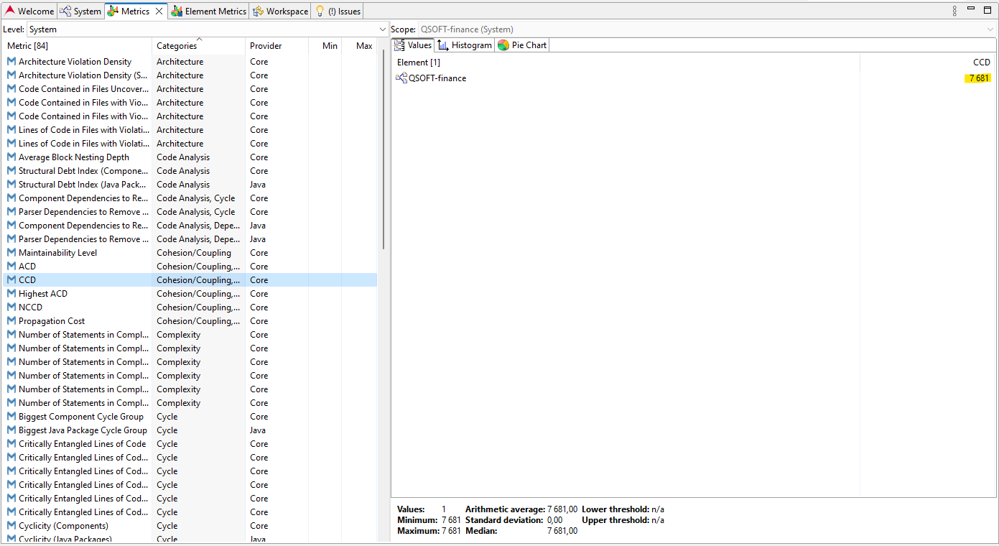
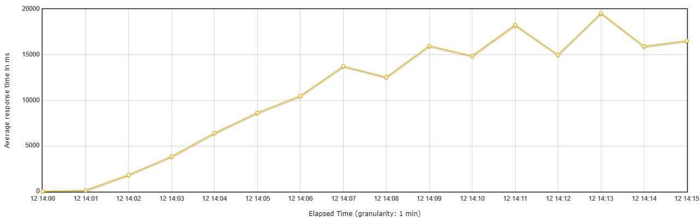

# Individual Report

### Masters in Informatics Engineering - 2023/24
**Student**: Simão Pedro Ribeiro  dos Santos (1230212)

<div style="page-break-after: always;"></div>

## Contents

---

* [List of figures](#list_of_figures)
* [1. Introduction](#introduction)
* [2. Maintainability](#maintainability)
    * [Cumulative component dependency](#ccd)
    * [Average component dependency](#acd)
    * [Comment ratio](#cr)
    * [Cyclomatic complexity](#cc)
    * [GQM Answering - What is the production code maintainability?](#gqm_1)
* [3. Performance](#performance)
    * [Scenario 1](#scenario_1)
        * [Load test](#load_test)
        * [Soak test](#soak_test)
    * [Scenario 2](#scenario_2)
        * [Stress test](#stress_test)
    * [Scenario 3](#scenario_3)
        * [Spike test](#spike_test)
    * [GQM Answering - What is the system's performance?](#gqm_2)
* [4. Security](#security)
    * [Dependency vulnerabilities](#dependency_vulnerabilities)
    * [Class Validations](#class_validations)
    * [GQM Answering - What are the system's security problems?](#gqm_3)
* [5. Architectural compliance](#architectural_compliance)
    * [Inspect the existence of cyclic dependencies](#cyclic_dependencies)
    * [Inspect if application complies with a layered architecture](#layered_architecture)
    * [GQM Answering - Does the system consistently follow architectural principles?](#gqm_4)
* [6. Maintainability of test code](#maintainability_of_test_code)
    * [GQM Answering - What is the test code maintainability?](#gqm_5)
* [7. Conclusions](#conclusions)
* [References](#references)
* [Appendices](#appendices)
    * [Appendix I](#appendix1)

<div style="page-break-after: always;"></div>

<a name="list_of_figures"></a>
## List of Figures

---

* [Figure 1 - Dependency graph](#figure1)
* [Figure 2 - Sonargraph CCD](#figure2)
* [Figure 3 - Sonargraph ACD](#figure3)
* [Figure 4 - Sonargraph lines of code and lines of comment](#figure4)
* [Figure 5 - Sonargraph Cyclomatic complexity](#figure5)
* [Figure 6 - Formal scenario 1](#figure6)
* [Figure 7 - Scenario 1 - Load test thread group](#figure7)
* [Figure 8 - Scenario 1 - Load test response times over time](#figure8)
* [Figure 9 - Scenario 1 - Load test average response times over time](#figure9)
* [Figure 10 - Scenario 1 - Load test response time overview](#figure10)
* [Figure 11 - Scenario 1 - Soak test thread group](#figure11)
* [Figure 12 - Scenario 1 - Soak test response times over time](#figure12)
* [Figure 13 - Scenario 1 - Soak test average response times over time](#figure13)
* [Figure 14 - Scenario 1 - Soak test response time overview](#figure14)
* [Figure 15 - Scenario 2 - Formal scenario 2](#figure15)
* [Figure 16 - Scenario 2 - Stress test thread group](#figure16)
* [Figure 17 - Scenario 2 - Stress test request summary](#figure17)
* [Figure 18 - Scenario 2 - Stress test response times over time](#figure18)
* [Figure 19 - Scenario 3 - Formal scenario 3](#figure19)
* [Figure 20 - Scenario 3 - Spike test thread group](#figure20)
* [Figure 21 - Scenario 3 - Spike test average response times over time](#figure21)
* [Figure 22 - Scenario 3 - Spike test script output](#figure22)
* [Figure 23 - OWASP Dependency-Check report](#figure23)
* [Figure 24 - NIST Vulnerabilities](#figure24)
* [Figure 25 - Cyclic dependencies output](#figure25)
* [Figure 26 - Layered architecture rules](#figure26)
* [Figure 27 - Layered architecture output](#figure27)
* [Figure 28 - jNose report extract from LedgerTest.java](#figure28)
* [Figure 29 - jmeter write test data into csv file](#figure29)
* [Figure 30 - dashboard directory](#figure30)

<div style="page-break-after: always;"></div>

<a name="introduction"></a>
## 1. Introduction

---

The purpose of this report is to document the quality assessments of a system, with the intention of facilitating its potential reuse within a different application context. The primary focus lies on key aspects such as maintainability, performance, security, architectural compliance, and the maintainability of the test code. Building upon the goal question metric (GQM) approach outlined in the global report, our main focus here is on gathering measurements for the Ledger Aggregate, though sometimes a holistic approach may be followed depending on the metric. These measurements will later be consolidated with others gathered by the team to address the overall GQM objectives in the comprehensive report.

<div style="page-break-after: always;"></div>

<a name="maintainability"></a>
## 2. Maintainability

--- 

This section is designed to address the GQM (Goal-Question-Metric) inquiries pertaining to maintainability. To achieve this objective, four key metrics have been selected: cumulative component dependency, average component dependency, comment ratio and cyclomatic complexity. 

<a name="ccd"></a>
### Cumulative component dependency (CCD)

The Cumulative Component Dependency (CCD) metric serves as a valuable indicator for assessing the coupling and structural erosion within a software system. This metric is particularly useful in understanding how components within the system depend on each other [[1]](#ref1).

**How CCD is Calculated**:

The metric is derived from directed dependencies represented by arrows between components.
Each component has a "Depends Upon" metric value, indicating the number of dependencies it has.
The Cumulative Component Dependency (CCD) is the sum of all "Depends Upon" values across all components [[1]](#ref1).

Figure 1 presents the dependency graph for a selected set of classes within the Ledger aggregate, showcasing the "Depends Upon" metric.

<a name="figure1"></a>

||
|:-------------------------------------:|
|*Figure 1 - Dependency graph*|

Here is the manual calculation of the CCD, focusing solely on the classes indicated in the last figure.

```math
Cumulative Component Dependency = 6 + 5 + 5 + 4 + 2 + 1 + 1 = 24
```

Sonargraph facilitates a comprehensive view of the CCD for our entire system, eliminating the need for manual calculations. Figure 2 displays the CCD metric from Sonargraph, highlighted in yellow.

<a name="figure2"></a>

||
|:-------------------------------------:|
|*Figure 2 - Sonargraph CCD*|

<a name="acd"></a>
### Average component dependency

The Average Component Dependency (ACD), derived by dividing CCD by the total number of components, serves as a normalized metric. With a range from 1 to the total number of components, ACD indicates the average number of dependencies for a randomly selected component in the system [[1]](#ref1).

A lower ACD suggests a more loosely coupled system, indicative of better architectural design, while a higher ACD implies greater interdependence and potential challenges in maintaining and evolving the system. An ACD of 1 signifies no dependencies, representing an ideal scenario [[1]](#ref1).

Context is crucial in interpreting ACD, as its value needs to be considered in relation to the total number of components. For example, a value of 100 may be acceptable in a system with 1,000 components but problematic in a system with only 100 [[1]](#ref1).

Figure 3 illustrates the ACD provided by Sonargraph. According to [[2]](#ref2) the recommended ACD threshold is 20. Since our system exceeds this limit with a value of 21.7, this may be an indicator that our system is over the desired level.

<a name="figure3"></a>

||
|:-------------------------------------:|
|*Figure 3 - Sonargraph ACD*|

<a name="cr"></a>
### Comment ratio (CR)

This metric assesses the Comment Ratio (CR), which is the ratio between lines of comments and the total lines of code [[3]](#ref3). For this evaluation, we will focus on the same seven classes used in the Cumulative Component Dependency (CCD) calculation and compute the CR for each class. A high comment ratio is indicative of well-documented code, enhancing its comprehensibility and maintainability. According to [[3]](#ref3), a good comment ratio is considered to be greater than 30 so we will use this value as reference.

To extract the necessary metrics, including the number of lines of code and the number of lines of comments per class, we will leverage Sonargraph, as exemplified in Figure 4. 

<a name="figure4"></a>

||
|:-------------------------------------:|
|*Figure 4 - Sonargraph lines of code and lines of comment*|

The presented table displays the Comment Ratio (CR) for each class. A noteworthy observation is that none of the classes demonstrates a CR higher than 30. This observation strongly suggests a general lack of code documentation within the system. It's important to note that this conclusion assumes that the remaining classes follow similar conventions. For a more accurate and comprehensive evaluation, it is important to consider all the classes in the codebase. 

|Class|Total lines of code|Comment lines|CR|
|----|----|----|----|
| Ledger.java | 297 | 10 | 3.37 |
| Transaction.java | 141 | 5 | 3.55 |
| AccountID.java | 90 | 18 | 20 |
| LedgerID.java | 87 | 14 | 16.09 |
| CreateGroupTransactionService.java | 245 | 28 | 11.42 |
| CreatePersonTransactionService.java | 223 | 19 | 8.52 |
| CreatePersonTransactionControllerREST.java | 88 | 3 | 3.40 |

<a name="cc"></a>
### Cyclomatic complexity

Cyclomatic complexity helps evaluate how complex our codebase is, and a harder codebase is usually harder to maintain [[1]](#ref1). According to [[1]](#ref1), the recommended threshold for cyclomatic complexity is 15.
By referring to Figure 5, which showcases data extracted from Sonargraph, we can observe that the maximum value for the cyclomatic complexity, highlighted in yellow, is 15. With this, we can reasonably assume that the system aligns with the recommended values for cyclomatic complexity. The absence of values exceeding the specified threshold suggests that the codebase is effectively managing complexity within acceptable bounds, contributing to maintainability and comprehensibility.

<a name="figure5"></a>

||
|:-------------------------------------:|
|*Figure 5 - Sonargraph Cyclomatic complexity*|

<a name="gqm_1"></a>
### GQM Answering - What is the production code maintainability?

| Target metric | Collected values | Threshold | Meets criteria |
| ------------- | ---------------- | --------- | -------------- |
| Average component dependency | 21.7 | max = 20 | No |
| Comment ratio  | All classes have a CR lower than the recommend threshold of 30   | min = 30 | No |
| Cyclomatic complexity | Maximum value captured by Sonnargraph is 15 | max = 15 | Yes | 


Upon analyzing the preceding table, it becomes evident that the system falls short of attaining the desired level of maintainability. This deficiency is primarily attributed to insufficient documentation and excessive coupling within the system. Wit this we can conclude that the **maintanability of the production code is not acceptable.**

<div style="page-break-after: always;"></div>

<a name="performance"></a>
## 3. Performance

---

This section is dedicated to the analysis of the system's performance. To achieve this, we will outline quality attribute scenarios that provide a clear definition of how our system should address specific quality attributes in a measurable manner.

Since the following scenarios focuses mainly on the creation of ledger transactions, the HTTP requests executed will be in the form of posts. To facilitate this, we'll leverage JMeter's capability to utilize a `CSV Data Set Config` to efficiently manage and input the necessary data for the post requests.

<a name="scenario_1"></a>
### Scenario 1

<u>**Raw scenario**</u>

The system must process and respond to requests for creating ledger transactions, maintaining an average response of less than 2 seconds under an anticipated user load of 200.

<u>**Formal scenario**</u>

<a name="figure6"></a>

||
|:-------------------------------------:|
|*Figure 6 - Formal scenario 1*|

To assess how the system responds to this scenario, we will conduct two types of performance tests: load tests and soak tests.

The load test aims to simulate and evaluate the system's behavior under an expected, realistic load of users over a specified time period [[4]](#ref4). This test will provide insights into how the system handles concurrent user activity, allowing us to measure its performance under typical usage scenarios. The soak test, on the other hand, will enable us to assess the system's stability and endurance over an extended duration [[4]](#ref4). By subjecting the system to a sustained load for an extended period, we can identify any potential issues related to long-term usage, such as gradual performance degradation.

<a name="load_test"></a>
> **Load test**

In this specific test, we employed a <u>steady ramp-up pattern</u> to simulate a realistic load on the system. This deliberate choice in ramp-up patterns allows us to mimic a scenario akin to the morning of a typical day when the number of users joining the platform increases until reaching the anticipated user load. By replicating this natural progression, our test aims to closely resemble real-world usage patterns, providing valuable insights into how the system performs under conditions mirroring the dynamics of a typical day.

<a name="figure7"></a>

||
|:-------------------------------------:|
|*Figure 7 - Scenario 1 - Load test thread group*|

During this performance test, the `jp@gc - Response Times Over Time` listener was used within our JMeter thread group, capturing valuable insights shown in figure 8. This graphical representation unveils distinct phases that offer a comprehensive understanding of our system's behavior under varying user loads.

Throughout the initial 1 minute and 31 seconds, with around 60 threads engaging the system, average response times remained minimal. This phase showcased the system's efficiency under a low user load.

The subsequent phase, spanning from the end of the initial period to the 5-minute mark, witnessed a gradual increase in thread count, peaking at 200 users. However, this upward trajectory coincided with a significant rise in average response times. The slope during this ramp-up period was steep, indicating a notable challenge in maintaining responsiveness as the user load intensified.

The final stage, from the 5-minute mark until the test's conclusion, maintained a consistent thread count of 200 users. While average response times continued to increase, the slope was less pronounced compared to the ramp-up period. This observation raises considerations about the system's potential to degrade in performance over sustained usage with a consistent load of 200 concurrent users.

In summary, our performance test delineates three crucial stages: an efficient initiation under low load, a challenging ramp-up period marked by escalating response times, and a sustained load phase indicating a persistent but less aggressive rise in average response times. 

<a name="figure8"></a>

||
|:-------------------------------------:|
|*Figure 8 - Scenario 1 - Load test response times over time*|

The following figures, figure 9 and 10, were generated through JMeter's capability to transform test data into a comprehensive dashboard — view [appendix I](#appendix1) for guidance on generating such dashboards. Focusing on figure 10, we observe a notable absence of errors in the HTTP requests. Additionally, the provided data highlighting the majority of response times exceeding 1.5 seconds resonates with the earlier insights discussed.

<a name="figure9"></a>

||
|:-------------------------------------:|
|*Figure 9 - Scenario 1 - Load test average response times over time*|

<a name="figure10"></a>

||
|:-------------------------------------:|
|*Figure 10 - Scenario 1 - Load test response time overview*|

<a name="soak_test"></a>
> **Soak test**

In the initial stage of this test, we will employ a <u>step ramp-up pattern</u> to simulate a systematic increase in user traffic on the system. This approach enables us to observe and evaluate the system's performance under progressively escalating loads until it reaches the anticipated peak. By doing so, we gain insights into how the system functions under varying load conditions over a specific period, facilitating a comprehensive assessment of its performance dynamics.

<a name="figure11"></a>

|
|:-------------------------------------:|
|*Figure 11 - Scenario 1 - Soak test thread group*|

With the assistance of figures 12 and 13, we will analyse the response times gathered during this test. Particularly noteworthy is the consistent pattern observed: each time the load increases, there is a marked increase in response times. This trend extends even during the 12-minute period of maintaining a steady load.

A key observation surfaces after the 48-minute mark in our test. Following this point, while sustaining a consistent load of 200 users for an additional 1 hour and 12 minutes, a escalation in response times becomes apparent. This observed trend accentuates potential performance challenges and prompts considerations for optimization. It signifies that the system's performance degrades as it contends with a sustained and heightened user load.

<a name="figure12"></a>

||
|:-------------------------------------:|
|*Figure 12 - Scenario 1 - Soak test response times over time*|

<a name="figure13"></a>

||
|:-------------------------------------:|
|*Figure 13 - Scenario 1 - Soak test average response times over time*|

In contrast to the preceding load test, a notable deviation is observed in the current test, with figure 14 revealing that 576 requests concluded with errors. <div style="page-break-after: always;"></div>

<a name="figure14"></a>

||
|:-------------------------------------:|
|*Figure 14 - Scenario 1 - Soak test response time overview*|

After an in-depth analysis of the data collected from the load test and soak test scenarios, it becomes evident that the system, as tested, does not meet the stipulated requirement of maintaining an average response time of less than 2 seconds under an anticipated user load of 200. The observed trends in increasing response times, particularly under heightened and sustained loads, underscore the need for further performance optimization.

<a name="scenario_2"></a>
### Scenario 2

<u>**Raw scenario**</u>: 

The system must be capable of supporting the creation of ledger transactions during a period of load increase equivalent to 200% of the expected load, with an error rate lower than 10%.

<u>**Formal scenario**</u>

<a name="figure15"></a>

||
|:-------------------------------------:|
|*Figure 15 - Formal scenario 2*|

<a name="stress_test"></a>
> **Stress test**

In this stress test, our goal is to see how well the system handles more load than usual [[4]](#ref4). We're doubling the workload by using 400 threads, which is twice the number we used in the previous test with 200 threads. This way, we can understand how the system performs under increased stress and identify any areas that fail. As shown in figure 16, we'll gradually increase the user load using a steady ramp-up pattern until reaching 400 users, similar to what we did in the load test.

<a name="figure16"></a>

||
|:-------------------------------------:|
|*Figure 16 - Scenario 2 - Stress test thread group*|

The next figure, figure 17, displays the request summary showcasing that only 0.04% of the requests resulted in errors. This compelling evidence strongly supports the assertion that the system successfully meets the specified criteria of maintaining an HTTP error rate below 10% even under the strain of intensive user loads.

<a name="figure17"></a>

||
|:-------------------------------------:|
|*Figure 17 - Scenario 2 - Stress test request summary*|

Additionally, shown in Figure 18, there's a noticeable increase in response times when compared to the response times observed during the load test. By the 5-minute mark, we're already reaching response times of around 15 seconds, whereas in the load test during this phase, the response times hovered around 8 seconds. Post the ramp-up, the response times continue to rise, althoughs at a slower pace, reaching up to 26 seconds, while in the load test, the maximum was approximately 18 seconds. This analysis aligns with expectations, considering that in this test, the system was subjected to a higher user load compared to the load test executed previously.

<a name="figure18"></a>

||
|:-------------------------------------:|
|*Figure 18 - Scenario 2 - Stress test response times over time*|

<a name="scenario_3"></a>
### Scenario 3

<u>**Raw scenario**</u>: 

The system must process the creation of ledger transactions with an average response time of less than 5 seconds when subjected to sudden bursts of user volumes of up to 300 users.

<u>**Formal scenario**</u>

<a name="figure19"></a>

||
|:-------------------------------------:|
|*Figure 19 - Formal scenario 3*|

<a name="spike_test"></a>
> **Spike test**

For this test, as you can see in figure 20, the peak-rest pattern was employed, specifically designed for assessing a system that might encounter heightened traffic during specific events. The objective of this test is to simulate scenarios such as discount periods, leading to a sudden burst in the number of transactions. The test configuration includes 40-second spikes with intervals of 120 seconds.

<a name="figure20"></a>

||
|:-------------------------------------:|
|*Figure 20 - Scenario 3 - Spike test thread group*|

As depicted in Figure 21, there is a noticeable trend of increasing average response times as the test unfolds. Notably, the response time exhibits clear spikes that align with the concurrent increase in the number of threads, as illustrated in the preceding chart.

<a name="figure21"></a>

||
|:-------------------------------------:|
|*Figure 21 - Scenario 3 - Spike test average response times over time*|

For a more detailed analysis of the system's response times during a spike, a Python script was developed to extract data for all requests made within the window of the spike occurrence. The script calculates the average response times separately for each spike, considering all requests made during the 40-second spike window.

You can find the script in the following location: `Part1/documentation/SimaoSantos1230212/jmeter/history/spike_test/scrip.py`. To execute the script, simply run the command 'python script.py' inside the directory (Make sure to use Python [3.12](https://www.python.org/downloads/release/python-3120/)).


The script execution output can be visualized in the following figure:

<a name="figure22"></a>

||
|:-------------------------------------:|
|*Figure 22 - Scenario 3 - Spike test script output*|

Following this thorough analysis, it is evident that the average response times during a spike tend to increase as the system execution progresses over time. We can conclude that the system fails to meet the specified requirement of responding to the creation of ledger transactions with an average response time of less than 5 seconds, when subjected to sudden bursts of user volumes of up to 300 users. This observation underscores the need for further optimization or adjustments to meet the performance criteria under peak load conditions.

<a name="gqm_2"></a>
### GQM Answering - What is the system's performance?

| Scenario | Target metric (KPI) | Collected values | Threshold | Meets criteria |
|----------| ------------------- |----------------- | --------- | -------------- |
| Scenario 1 | Average response time | Average response times during 200 user load ranged between [7.5; 13] s under load test conditions, and between [22; 31] s under soak test conditions. | Average response time < 2 s | No |         
| Scenario 2 | Http error rate | 0.04% of the requests resulted in errors. | Http error rate < 10% | Yes |
| Scenario 3 | Average response time | Average response times during peak loads of 300 users ranged between [14.6; 20.6] s. | Average response time < 5 s  |No | 

Considering the previous table, we can conclude that **the system's performance is not acceptable.**

<div style="page-break-after: always;"></div>

<a name="security"></a>
## 4. Security

---

Regarding security, we will conduct two types of analyses. First, we will employ the OWASP Dependency-Check to identify project dependencies and assess if any have a severity level high enough to raise concerns. Secondly, we will randomly select some classes for sampling and analyze if there are input validations.

<a name="dependency_vulnerabilities"></a>
### Dependency vulnerabilities

Using the OWASP dependecy checker is preety simple, since this is a maven project the only need is to add the dependecy to the project and  execute the following command (for more information [click here](https://jeremylong.github.io/DependencyCheck/)).

```
mvn org.owasp:dependency-check-maven:check
```

After executing the command, a  report is generated as shown in Figure 23. Notably, there are several dependencies with severity levels ranging from Medium to Critical, warranting attention. Given the academic environment, we will concentrate on addressing one specific dependency, as indicated by the red arrow in the figure 23.
The dependency checker has identified 11 Common Vulnerabilities and Exposures (CVEs) associated with this particular dependency. The assessment carries a high level of confidence, indicating a strong certainty regarding the actual existence of these vulnerabilities. Additionally, the identification process is supported by a total of 36 pieces of evidence, further substantiating the presence of these vulnerabilities within the dependency. 

<a name="figure23"></a>

||
|:-------------------------------------:|
|*Figure 23 - OWASP Dependency-Check report*|

The figure below, denoted as figure 24, presents the vulnerability details of the identified dependency. This information is accessible through the National Vulnerability Database provided by the National Institute of Standards and Technology.

<a name="figure24"></a>

||
|:-------------------------------------:|
|*Figure 24 - NIST Vulnerabilities*|

In this case, it would be beneficial to consider adopting a newer version of this dependency. Upon reviewing the [Maven repository](https://mvnrepository.com/artifact/org.springframework/spring-webmvc), versions higher than 6.0.7 have no reported vulnerabilities (as of the consultation made on 13/11/2023 at 00:09).

<a name="class_validations"></a>
### Class Validations

As highlighted previously, to ensure manageability, we will selectively analyze a sample group of n classes during this phase to assess input validations. However, it's crucial to note that for a more comprehensive and precise evaluation, all classes should be evaluated carefully. This selective approach allows us to efficiently manage the analysis while maintaining the potential for a thorough understanding of input validation practices across the entire codebase.

A consensus has been reached among the members of the group to rate the classes on a scale from 1 to 3 based on the robustness of input validations. The table below outlines the criteria used for this evaluation:

| Measurement| Rational     | 
|--------------|-----------|
| 1 | No validations     |
| 2 | Has validations only in terms of technical perspective*  |
| 3| Has validations only in terms of technical and domain perspective** |

> *Technical perspective : The software checks for validations in terms of java compilation errors, e.g., check if the instance is not null, the list doesn't contain null values, etc., but ignores the domain validation, an email's String has the same treatment as an address's String.
>
> **Domain perspective : In addition to technical validations, the software checks for validations in terms of the domain, e.g, if the email is on the expected format.

Each class will be assessed according to these criteria, providing a clear understanding of the input validation practices employed across the selected sample. The table below presents the evaluations made:

| Class | Evaluation |
|-------|------------|
| Transaction.java   | 2 |   
| Ledger.java        | 1 | 
| Amount.java        | 1 | 
| Type.java          | 2 |  
| Description.java   | 1 |  
| Date.java          | 2 | 
| CategoryId.java    | 2 |
| Denomination.java  | 2 |

The code snippet below, extracted from the project's source code class **`Transactions.java`**, elucidates the rationale behind assigning a rating of 2 to this class. While there are explicit validations for null checks, there are concerns in terms of domain-specific validation. Upon analysis, it becomes apparent that the description field could potentially be an empty string, and the amount may not adequately represent whether the transaction is of type credit or debit. These considerations highlight areas of potential concern, emphasizing the need for more nuanced and domain-aware input validations.

```java
    private Transaction(CategoryID categoryID, String type, String description, double amount, LocalDate date, AccountID debitAccountID, AccountID creditAccountID) {
        if (categoryID == null) {
            throw new IllegalArgumentException("Transaction not created due to the fact that the categoryID parameter hasn't a valid argument");
        }
        if (type == null) {
            throw new IllegalArgumentException("Transaction not created due to the fact that the type parameter hasn't a valid argument");
        }
        if (description == null) {
            throw new IllegalArgumentException("Transaction not created due to the fact that the description parameter hasn't a valid argument");
        }
        if (date == null) {
            throw new IllegalArgumentException("Transaction not created due to the fact that the date parameter hasn't a valid argument");
        }
        if (debitAccountID == null) {
            throw new IllegalArgumentException("Transaction not created due to the fact that the debitAccountID parameter hasn't a valid argument");
        } else if (creditAccountID == null) {
            throw new IllegalArgumentException("Transaction not created due to the fact that the creditAccountID parameter hasn't a valid argument");
        }
        this.categoryID = categoryID;
        this.type = Type.createType(type);
        this.description = Description.createDescription(description);
        this.amount = Amount.createAmount(amount);
        this.date = Date.createDate(date);
        this.debitAccountID = debitAccountID;
        this.creditAccountID = creditAccountID;
    }
```

In contrast, upon examining the **`Ledger.java`** class, it becomes evident that there are even fewer validations, notably the absence of null checks when creating a ledger. This lack of input validation raises concerns regarding the integrity of the ledger creation process. This explains the evaluation of 1.

```java
    public Ledger(LedgerID ledgerID) {
        this.ledgerID = ledgerID;
        this.records = new ArrayList<Transaction>();
    }
```

<a name="gqm_3"></a>
### GQM Answering - What are the system's security problems?

| Target metric | Threshold | Meets criteria |
| ------------- | --------- | -------------- |
| Level of class validations | All classes having level 3 | No |
| Level of dependency vulnerabilities | Every dependency vulnerability should exhibit a severity level no higher than Medium. | No, however this issue could be remedied by upgrading the dependency. |

In summary, in terms of security, it can be inferred that the system falls short of expectations. This is evident in the validation aspect, where the highest achieved level of validation is 2. Addressing the vulnerability concern is feasible by upgrading to a recent version, although a more detailed analysis is required to assess other project dependencies. Consequently, based on the insights presented in this document, the response to the GQM question related to security is that **the software does not have acceptable security**.

<div style="page-break-after: always;"></div>

<a name="architectural_compliance"></a>
## 5. Architectural compliance

This section is dedicated to evaluating the architectural compliance of the system. To accomplish this, we will employ a specific technique that involves implementing fitness functions. While the term "fitness functions" is often linked with evolutionary computing, here it refers to a method for assessing architectural qualities [[1]](#ref1). Unlike traditional fitness functions in evolutionary computing, which gauge the success of potential solutions, these architectural fitness functions allow us to target specific metrics or a group of metrics [[1]](#ref1). This approach helps us systematically evaluate how our system responds to various quality attributes.
Depending on how costly this fitness functions are, they can be easly integrated in a CI/CD pipeline if they are cheap and easy to run [[1]](#ref1). 

Furthermore, a noteworthy aspect of this evaluation strategy involves leveraging the synergy between fitness functions and `ArchUnit`. This combination enhances our ability to measure specific facets of architectural compliance.

<a name="cyclic_dependencies"></a>
### Inspect the existence of cyclic dependencies

The goal for this fitness function is to evaluate if the application contains any cyclic dependency. A cyclic dependency is formed when two or more components depend on each other and is a common source of subtle bugs [[5]](#ref5). Furthermore, the presence of cyclic dependencies can increase the impact of modifications, as changes to one class within the cycle may propagate changes in other interconnected classes due to the cyclical nature of these dependencies [[5]](#ref5).

**Breadth of feedback**: Holistic\
**Execution trigger**:  Periodical and in the test environment.\
**Metric type**: Binary\
**Automated**: No (manually executed)\
**Quality attribute requirements**: Maintainability\
**Static or dynamic**: Static  (the fitness function is statically defined and does not depend on values from other fonts).

`Fitness function implementation`
```java
@ArchTest
static void applicationDoesNotHaveCyclicDependencies(JavaClasses classes) {
    slices().matching("com.finance.project.(*)..").should().beFreeOfCycles().check(classes);
}
```

The following image displays the output of the test execution meaning that there are 2 cyclic dependencies on the source code.

<a name="figure25"></a>

||
|:-------------------------------------:|
|*Figure 25 - Cyclic dependencies output*|

<a name="layered_architecture"></a>
### Inspect if application complies with a layered architecture

The primary aim of this fitness function is to carefully examine the source code to ensure the total adherence to the principles imposed by a layered architecture. This evaluation provides the capacity for seamless and continuous checks, making it particularly suitable for integration into a CI/CD pipeline. Leveraging the robust capabilities of ArchUnit, this function enables the defining of specific rules that offer prompt feedback on any violations detected. For instance, it can effectively identify cases where an inner layer inappropriately accesses an outer layer or where access bypasses prescribed layers, providing insights about the architectural integrity of the codebase.

Figure 26 visually presents the layered architecture conventions derived from the analysis of the source code. With this knowledge, and taking advantage of the capabilities offered by ArchUnit, we can encode these rules into a fitness function to check for violations.

<a name="figure26"></a>

||
|:-------------------------------------:|
|*Figure 26 - Layered architecture rules*|

**Breadth of feedback**: Holistic\
**Execution trigger**:  Periodical and in the test environment.\
**Metric type**: Binary\
**Automated**: No (manually executed)\
**Quality attribute requirements**: Maintainability\
**Static or dynamic**: Static  (the fitness function is statically defined and does not depend on values from other fonts).

`Fitness function implementation`
```java
@ArchTest
static void applicationFollowsLayeredArchitecture(JavaClasses classes) {
    layeredArchitecture()
            .consideringAllDependencies()
            .ignoreDependency(fullNameMatching("com.finance.project.Bootstrapping"), alwaysTrue())
            .ignoreDependency(fullNameMatching("com.finance.project.ProjectApplication"), alwaysTrue())
            .layer("controllerLayer").definedBy("com.finance.project.controllerLayer..")
            .layer("applicationLayer").definedBy("com.finance.project.applicationLayer..")
            .layer("domainLayer").definedBy("com.finance.project.domainLayer..")
            .layer("dtos").definedBy("com.finance.project.dtos..")
            .layer("dataModel").definedBy("com.finance.project.dataModel..")
            .layer("infrastructureLayer").definedBy("com.finance.project.infrastructureLayer..")
            .layer("persistenceLayer").definedBy("com.finance.project.persistenceLayer..")

            .whereLayer("controllerLayer").mayNotBeAccessedByAnyLayer()
            .whereLayer("applicationLayer").mayOnlyBeAccessedByLayers("controllerLayer")
            .whereLayer("domainLayer").mayOnlyBeAccessedByLayers("applicationLayer", "dataModel", "infrastructureLayer")
            .whereLayer("dtos").mayOnlyBeAccessedByLayers("controllerLayer", "applicationLayer")
            .whereLayer("dataModel").mayOnlyBeAccessedByLayers("infrastructureLayer", "persistenceLayer")
            .whereLayer("infrastructureLayer")mayOnlyBeAccessedByLayers("applicationLayer")
            .whereLayer("persistenceLayer").mayOnlyBeAccessedByLayers("infrastructureLayer")

            .check(classes);
    }
```

The following image displays the output of the test execution meaning that the rules defined by the test were violated 171 times.

<a name="figure27"></a>

||
|:-------------------------------------:|
|*Figure 27 - Layered architecture output*|

<a name="gqm_4"></a>
### GQM Answering - Does the system consistently follow architectural principles?

| Target metric | Collected values | Threshold | Meets criteria |
| ------------- | ---------------- | --------- | -------------- |
| Number of dependency cycles | 2 | 0 | No |
| Number of layer access violations | 171 | 0 | No |

Upon reviewing the preceding table, it is evident that **the system's architectural compliance is not acceptable.** This judgment is based on the presence of dependency cycles and the infringement of access between layers.

<div style="page-break-after: always;"></div>

<a name="maintainability_of_test_code"></a>
## 6. Maintainability of test code

---

This section will be oriented into evaluating the maintainability of the test code. Bad programming practices do not happen solely on the production code, they also happen during test implementation wich difficults the maintainability of our system. Given this, we will focus on finding test smells (sub-optimal design choices developers made when implementing the test cases). Since identifing test smells obligats a static analysis of the test code, we wil use a tool called jNose to automatically detect test smells in our test code.

jNose helps indentify several types of test smells, such as:

- Assertion Roulette: Occurs when a test method includes multiple assertions without descriptive messages [[6]](#ref6).
- Eager Test: Indicates a test lacking a single, clear purpose [[7]](#ref7).
- Empty Test: Test methods that do not contain executable instructions [[8]](#ref8).
- General Fixture: Implies a test setup that is too broad or shared across multiple test cases [[8]](#ref8). 
- Ignored Test: Denotes suppressed test methods, causing overhead in terms of compilation time and increasing code complexity [[8]](#ref8).
-  Magic Numbers: Tests containing assertions with numeric literals lacking indication of their meaning or purpose [[8]](#ref8).
- Mystery guest: Tests relying on external resources, making them not self-contained [[8]](#ref8).
- Resource Optimism: Test code making assumptions about the existence or absence of specific external resources [[8]](#ref8).
- Sleepy test: Introduced when developers need to pause the execution of test instructions [[8]](#ref8).
- Verbose Test: Occurs when tests use excessive code to achieve their objectives [[8]](#ref8).

The following images, extracted from the jNose report, present the count of test smells per category within a selected sample group of classes. jNose also has the ability to tell the exact interval of lines where a test smell was found. To enhance and solidify the observations made by jNose, we intend to show a sample of the identified test smells with concrete evidence extracted directly from the source code.

**jNose - LedgerTest.java**

<a name="figure28"></a>

||
|:-------------------------------------:|
|*Figure 28 - jNose report extract from LedgerTest.java*|

<u>Assertion Roulette (lines 24-35)</u>

Here, we encounter a clear example of an assertion roulette, as highlighted by jNose, which points out the absence of a descriptive message associated with the assert statement. Providing clear and informative messages boosts the maintainability of our code.

```java
@Test
@DisplayName("Verify if the Ledger have been created")
public void testConstructorLedger() {
    ...
    assertEquals(expectedRegists, ledgerRegists);
}
```

<u>Eager Test (lines 116-162)</u>

In this scenario, jNose has flagged an eager test, indicating a potential issue. However, upon further analysis, we believe this to be a false positive. The reason behind this conclusion lies in the need of having both assertions within the test.

```java
@Test
@DisplayName("Verify if one transaction have been created and added to ledger | Get transaction")
public void testGetTransactionAdded() {
    ...
    //Assert;
    assertEquals(expectedRegists, ledgerJoao.getRecords()); //Compara o arraylist com o registo das transações
    assertEquals(newTransaction, ledgerJoao.getRecords().get(transactionIndex)); //Compara a transação que foi adicionada
    }
```

<u>Redundant Assertion and Verbose test (lines 2649-2708)</u>

In this given context, jNose has identified two test smells associated with a single test, signaling a concern related to redundancy and verbosity in the test code. It is evident that the assertion being made lacks logical coherence as it essentially compares the hashcodes of the same object. Additionally, jNose points out that the test is verbose due to its extensive span across multiple lines, indicating a potential need for simplification.

```java
@Test
@DisplayName("Verify same object | Same Hashcode")
public void testEqualsDifferentHashCode() {
    ...
    assertEquals(ledgerJoao.hashCode(), ledgerJoao.hashCode());
}
```

<a name="gqm_5"></a>
### GQM Answering - What is the test code maintainability?

The presence of a considerable number of Verbose Tests, Lazy Tests, and Assertions Roulettes is unmistakable. Addressing these issues holds the potential to elevate the system's maintainability to a higher level. Furthermore, the substantial number of tests per class contributes to a decrease in the overall maintainability level. Considering the prevalence of these cases, the prudent stance is to assert that **the system currently lacks acceptable maintainability of test code.**

<div style="page-break-after: always;"></div>

<a name="conclusions"></a>
## 7. Conclusions

---

Upon thorough analysis, it becomes evident that the system encounters several significant challenges in its key aspects. In terms of maintainability, the system expresses a notable shortfall, particularly highlighted by the average component dependency (ACD) value, which stands at 21.7, exceeding the target threshold of 20. However, a more warning concern emerges in the form of the comment ratio, pointing to inadequate documentation practices. The low rate of comments per total lines of code significantly impacts the system's overall maintainability. However cyclomatic complexity, meets the recommended threshold of 15, reflecting a maintainable code complexity. Shifting focus to performance, the system fails to meet the desired requirements in scenarios 1 and 3, highlighting divergencies from the desired average response times. Contrariwise, in scenario 2, the system aligns with criteria, maintaining an HTTP error rate below 10% under overload conditions. When it comes to security the major problem is the lack of validations, neither of the analysed classes presented validations related to domain, this being a major concern by decreasing the level of the system security. Related to the architectural compliance the system broke all the rules defined by the tests having a total of 2 cyclic dependencies and violating 171 times the layered architecture conventions. Finally, examining test code maintainability reveals a debatable landscape. While assertion roulette-related smells are present, their severity can be considered relatively low. The overarching issue lies in verbose tests, characterized by excessive length, and a surplus of methods per class. In light of these findings, it is evident that the system does not meet acceptable standards in any of the key aspects examined.

<div style="page-break-after: always;"></div>

<a name="references"></a>
## References

---

<a name="ref1"></a>
**[1]**  Ciceri, C., Farley, D., Ford, N., Harmel-Law, A., Keeling, M., Lilienthal, C., Rosa, J., Von Zitzewitz, A., Weiss, R., & Woods, E. (2022). Software Architecture Metrics. O’Reilly Media.

<a name="ref2"></a>
**[2]** Eisele, M. (2009, December 9). Software Quality: The Basics II - CCD, ACD, Ca, Ce, I, A, I/A and D. Enterprise Software Development With Java. https://blog.eisele.net/2009/12/software-quality-basics-ii-ccd-acd-ca.html

<a name="ref3"></a>
**[3]** Comment Ratio (CR) – Code Quality Docs. (n.d.). https://docs.embold.io/comment-ratio/

<a name="ref4"></a>
**[4]** Certified Tester Performance Testing (CT-PT). (n.d.). ISTQB Not-for-profit Association. https://www.istqb.org/certifications/performance-tester

<a name="ref5"></a>
**[5]** Duato, J. (2003). Routing algorithms. In Elsevier eBooks (pp. 139–206). https://doi.org/10.1016/b978-155860852-8/50007-9

<a name="ref6"></a>
**[6]** Software unit test smells. (n.d.). https://testsmells.org/

<a name="ref7"></a>
**[7]** Panichella, A., Panichella, S., Fraser, G., Sawant, A. A., & Hellendoorn, V. J. (2020). Revisiting Test Smells in Automatically Generated Tests: Limitations, Pitfalls, and Opportunities. 2020 IEEE International Conference on Software Maintenance and Evolution (ICSME). https://doi.org/10.1109/icsme46990.2020.00056

<a name="ref8"></a>
**[8]** Van Deursen, A., Moonen, L., Bergh, A., & Kok, G. (2001). Refactoring test code. ResearchGate. https://www.researchgate.net/publication/2534882_Refactoring_Test_Code

<div style="page-break-after: always;"></div>

<a name="appendices"></a>
## Appendices

---

<a name="appendix1"></a>
### Appendix I

This appendix serves as a guide for the process of generating a JMeter report dashboard. The JMeter dashboard generator, an extension of JMeter, operates modularly and defaults to reading and processing samples from CSV files. Its primary function is to generate HTML files containing various graph views, showcasing metrics such as a request summary graph, active threads over time, latencies over time, response codes per second, response time overview, and more. 

Firstly we have to save our test data into a csv file by configuring a write file results in the view results tree listener as shown on the next figure:

<a name="figure29"></a>

||
|:-------------------------------------:|
|*Figure 29 - jmeter write test data into csv file*|

Upon test execution, proceed to generate the JMeter report dashboard using the following command:

```
jmeter -g result_data.csv -o ./dashboard
```

Ensure that you execute this command within the directory containing the results CSV file. The output dashboard will be generated, as illustrated below:

<a name="figure30"></a>

||
|:-------------------------------------:|
|*Figure 30 - dashboard directory*|
